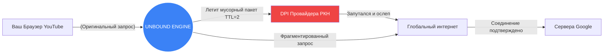

<div align="center">


# 🚀 UNBOUND v2.0
**Универсальная мультиплатформенная пушка для обхода любых DPI блокировок**

[](#) 
[](#) 
[](#) 
[](#) 
[](#) 
[](#) 
[](#)

<a href="#-почему-unbound">🏆 Почему Unbound?</a> • 
<a href="#-как-эта-херня-работает">⚙️ Под капотом</a> • 
<a href="#-установка-и-платформы">📦 Скачать под свою ОС</a> • 
<a href="#-детали-для-гиков">💻 Для программистов</a>

<br/>

<br/>

*Доступ к YouTube, Instagram, Discord, Twitter и сотням других ресурсов без просадок скорости и без покупки VPN.*

</div>

---

## 🏆 Почему Unbound?

Забудь про медленные VPN, отваливающиеся прокси и километровые туннели, которые урезают скорость провайдера в три раза и повышают пинг до небес.

**Unbound — это НЕ VPN.**
Это нативный оркестратор пакетов, который работает прямо в сетевом стеке вашей операционной системы. Ваш трафик идет напрямую от вашего роутера к серверам Google/Discord, но программа локально «кромсает» и «мутирует» TCP-пакеты так, что фильтры провайдера (система DPI - Deep Packet Inspection) сходят с ума и пропускают вас на заблокированный сайт.

🔥 **Главные фишки:**
*   ⚡ **Нулевая потеря скорости (Zero Penalty)** — Качай гигабайты и смотри 4K. Скорость не ограничена чужим сервером.
*   🕹️ **Нулевой пинг в играх** — Трафик идет напрямую. Discord работает кристально чисто без лагов.
*   🛡️ **100% Локально и Анонимно** — Программа не отправляет ни байта телеметрии. Никаких аккаунтов, никаких регистраций. Исходный код открыт — проверяйте сами.
*   🎨 **Сочные темы оформления** — Скучно сидеть в сером окне? Выбирай `Aura`, `Win95` или `Liquid Glass` прямо в интерфейсе!

---

## ⚙️ Как эта херня работает? (Архитектура простым языком)

Провайдеры используют DPI-оборудование, чтобы отлавливать слово "youtube.com" или "discord.gg" прямо в вашем трафике во время самого первого "рукопожатия" (ClientHelloTLS).

**Что делает Unbound:**
В то время как другие делают туннели, Unbound берет ваш запрос и в реальном времени применяет тактики ниндзя:
1. **Дефрагментация пакетов:** Режет слово `youtube.com` на микроскопические пакеты: `you`, `tu`, `be.com`. Тупой DPI не может читать их по отдельности и пропускает. Целевой сервер собирает их обратно.
2. **Фейковый TTL-спуфинг:** Выплевывает "мусорные" пакеты со сломанным временем жизни (TTL), которые оседают и забивают анализатор провайдера, но никогда не долетают до настоящего сайта.
3. **Смещение окна (Window Size):** Перемешивает номера ответов, доводя DPI-фильтры до паники.



Мы не привязываемся к одному инструменту. Для каждой ОС в Unbound запаян свой идеальный нативный движок.

---

## 📦 Установка и Платформы

Качай билд именно под свое устройство. Без танцев с бубном. Все скачивания лежат во вкладке **[Releases (КЛИКАЙ СЮДА)](https://github.com/bobberdolle1/unbound/releases/latest)**.

| ОС / Устройство | Используемый движок в Unbound | Как поставить? |
| :--- | :--- | :--- |
| **Windows 10/11** | Ядерный драйвер `WinDivert` + `zapret` | Скачай `.exe`, запусти от Админа, нажми "Подключить". |
| **macOS (Intel/M1+)** | `SpoofDPI` (SOCKS5/kqueue) | Скачай `.app`, перекинь в Программы, разреши запуск в Настройках, нажми "Подключить". |
| **Linux / SteamOS** | `nfqws` + `nftables` | Скачай `unbound-linux-amd64`, выполни `sudo ./unbound start`. Зависимости: `nftables`. |
| **Android** | `VpnService` + C-ядро | Скачай и поставь `.apk`. Нажми Start. (Или установи Magisk ZIP для root-режима). |
| **OpenWrt Роутеры**| `zapret` (MIPS/ARM) | Закинь `.ipk` плагины на роутер через WinSCP. Рули прямо из веб-морды LuCI! |

> [!WARNING]
> Блокировки в разных городах могут отличаться! Если не работает профиль по умолчанию, нажми кнопку **"Magic Wand / Автоподбор"**, и Unbound сам прощупает провайдера и выберет самую мощную стратегию конкретно для твоей квартиры.

---

## 💻 Для программистов (Мануалы по коду)

Unbound разработан по принципу "Разделяй и властвуй". Интерфейс на React/Wails — отдельно, суровые C/Rust бэкенды — отдельно. 

Хочешь собрать всё сам или залезть в код? Читай наши ультра-детальные русскоязычные технические гайды:

*   🐧 **Linux & Steam Deck:** [Как работает наш NFQUEUE драйвер на Rust ->](linux/README.md)
*   🤖 **Android APK & NDK:** [Как компилить нативное ядро через Gradle ->](android/README.md)
*   🍎 **macOS Darwin API:** [Как мы прокидываем настройки прокси в SCPreferences ->](macos/README.md)
*   🌐 **OpenWrt роутеры:** [Сборка пакетов под OpenWrt SDK ->](openwrt/README.md)
*   🍏 **iOS Jailbreak:** [Написание Theos-твика под Cydia/Dopamine ->](theos/unbound-legacy/README.md)

### 🛠 Кросскомпиляция Десктопа за одну команду
У тебя должны стоять `Go`, `NodeJS` и `Wails CLI`.
```bash
git clone https://github.com/bobberdolle1/unbound.git
cd unbound
npm install --prefix frontend
# Собираем мощь!
wails build -platform windows/amd64,darwin/arm64
```

---

## 📜 Лицензия и Благодарности

**GPL-3.0**. Делайте форки, улучшайте, делитесь.

Огромный респект и почёт гигантам Open Source систем: **bol-van** (за легендарный `zapret`), **basil00** (за `WinDivert`), **ValdikSS** (за идеи `GoodbyeDPI`), и **xvzc** (за `SpoofDPI`). Без этих титанов мы бы до сих пор сидели через медленные прокси.

<p align="center">
  <sub>Создано с гордостью командой UNBOUND. Интернет должен быть свободным. 🇷🇺 2024-2026</sub>
</p>
