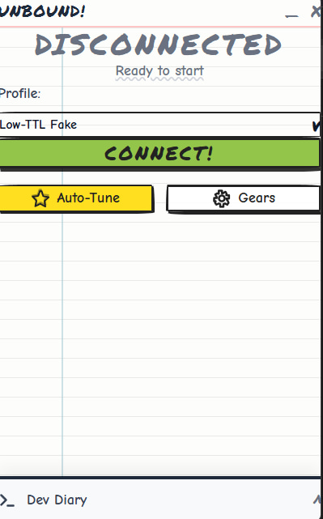
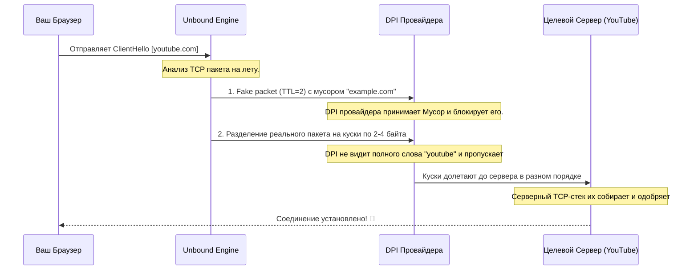

<div align="center">


# 🚀 UNBOUND v2.0
**Мультиплатформенная пушка для прозрачного обхода DPI-блокировок.** <br>
*Zero latency. Zero overhead. Zero VPN.*

[](#) 
[](#)
[](#)



[**🌐 Скачать**](#-поддерживаемые-платформы-и-установка) &nbsp; | &nbsp; [**✨ Архитектура**](#-как-работает-движок) &nbsp; | &nbsp; [**📖 Документация**](#-компиляция-из-исходников) &nbsp; | &nbsp; [**🖥 Официальный Сайт**](https://bobberdolle1.github.io/unbound)

> **Unbound** — это ультимативный локальный оркестратор пакетов. Он не использует VPN, удалённые серверы или внешние прокси. Программа напрямую кромсает, модифицирует и десинхронизирует TCP/UDP-трафик на уровне сетевого стека вашей ОС, заставляя системы Deep Packet Inspection (DPI) провайдера ослепнуть и пропустить вас к заблокированному ресурсу.

</div>

<br>

## 🏆 Ключевые возможности

<table>
  <tr>
    <td width="50%">
      <h3>⚡ Скорость провайдера</h3>
      <p>Никаких туннелей. Никакого пинга. Трафик идет напрямую до целевого сервера, гарантируя максимальную пропускную способность для загрузки 4K-видео и нулевые задержки в играх вроде Discord.</p>
    </td>
    <td width="50%">
      <h3>🛡 Полная Анонимность</h3>
      <p>В отличие от VPN-сервисов, Unbound на 100% автономен. Программа не осуществляет сбор телеметрии, не требует аккаунтов и не отправляет ваши личные данные на "анонимные" удалённые серверы.</p>
    </td>
  </tr>
  <tr>
    <td width="50%">
      <h3>🕹 Нативная интеграция</h3>
      <p>Интеграция на уровень ядра (L3/L4) с помощью встроенных драйверов WinDivert (Windows), Packet Filter (macOS) и Netfilter (Linux). Никаких виртуальных сетевых адаптеров TUN/TAP и танцев с бубном.</p>
    </td>
    <td width="50%">
      <h3>🎨 UI нового поколения</h3>
      <p>Движок управления обладает сверхбыстрым графическим интерфейсом на базе Wails с невероятными кастомными темами (Скевоморфизм, Doodle Jump, Metro UI, Liquid Glass и другие).</p>
    </td>
  </tr>
</table>

---

## 🧩 Поддерживаемые платформы и установка

Unbound скомпилирован под подавляющее большинство операционных систем. **Не требует настройки — скачал, нажал одну кнопку, всё работает.**

| Платформа | Технология-Драйвер | Инструкция к установке | Статус |
| :--- | :--- | :--- | :---: |
|  **Windows 10/11** | `WinDivert` | Распакуйте ZIP и запустите `unbound.exe` от Админа. Драйвер встроен в бинарник. | ✅ |
|  **macOS (Intel/M1+)** | `pf` + Raw Sockets | Запустите с правами суперпользователя: `sudo ./unbound-darwin-amd64`. | ✅ |
|  **Linux** | `iptables` / `NFQUEUE` | Запустите от `root`. Правила iptables обновляются на лету. | ✅ |
|  **Android 8.0+** | `VpnService API` | Установите `app-release.apk` и разрешите локальный VPN профиль профиль. | ✅ |
|  **iOS (Jailbreak)** | `launchd` демон | Установите `.deb` пакет через Sileo/Zebra (Rootful / Rootless). | ✅ |
|  **OpenWRT** | Нативный пакет | Закиньте и установите `.ipk` через `opkg install`, настройте в LuCI. | ✅ |

📥 **Все бинарники доступны в разделе [GitHub Releases](../../releases).**

---

## ⚙️ Как работает движок? (Краткая архитектура)

Большинство провайдеров используют пассивные (зеркалированные) DPI или inline анализаторы пакетов. Они ищут ключевые слова вроде `googlevideo.com` при установке безопасного соединения TLS-сессии (ClientHello). 

Unbound перехватывает эти пакеты до отправки провайдеру и применяет арсенал механизмов обхода:



**Ключевые методики пробития:**
1. **Дефрагментация пакета (Fragmentation):** Дробление SNI-домена (ClientHello) на мелкие TCP-сегменты, которые фильтр провайдера не может собрать воедино.
2. **Мусорная переадресация (Fake TTL):** Отсылка фальшивого пакета, жизнь которого сгорает у оператора, забивая кеш DPI-фильтра и прокладывая дорогу подлинному запросу.
3. **Рассинхрон Window Size:** Специальное манипулирование размерами TCP Window Size для обхода stateful-анализаторов пакетов.

---

## 💻 Компиляция из исходников

Если вы хотите собрать ядро или GUI-оболочку приложения самостоятельно:
**Требования:**
* Наличие `Go` v1.21+
* Наличие `Node.js` v18+ (для сборки UI наsvelte/react)
* Сборочный пакет `Wails` (`go install github.com/wailsapp/wails/v2/cmd/wails@latest`)

```bash
# Клонируем проект
git clone https://github.com/bobberdolle1/unbound.git
cd unbound

# Компиляция ядра CLI-режима под текущую архитектуру:
go build -ldflags="-s -w" -o unbound_cli ./main.go

# Сборка Wails графического приложения (настольные ОС)
wails build -m
```

> **Важно:** Подробные инструкции по сборке пакетов для *iOS (theos)*, *Android (gradle)*, и *OpenWRT* лежат в соответствующих папках: `/ios`, `/android`, `/openwrt`.

---

## 📜 Поддержать проект

Исходный код распространяется под лицензией **MIT License**. Модификации, форки и коммерция разрешены.
Если проект был полезен — **поставьте ему ⭐ на GitHub**, это здорово помогает развитию!

<div align="center">
    <br>
    <i>Разработано с любовью к свободному интернету.</i>
</div>
