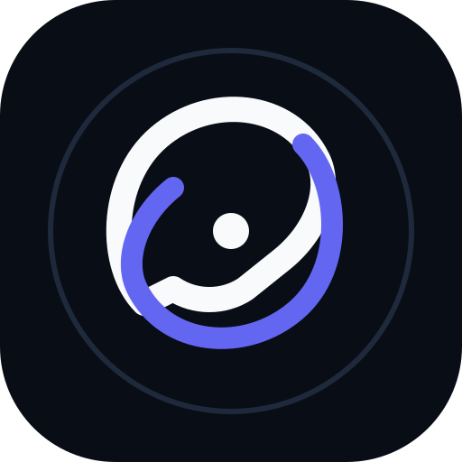

<div align="center">



# UNBOUND `v0.3.0-rc.2`
**Локальный настольный оркестратор десинхронизации L3/L4 трафика для macOS, Windows и Linux.**

[](#)
[](#)
[](SECURITY.md)
[](LICENSE)

[**🔒 Безопасность**](#-безопасность-и-гарантии-доверия) &nbsp; | &nbsp; [**🖥️ Интерфейс**](#-интерфейс-и-дизайн-системы) &nbsp; | &nbsp; [**⚡ Архитектура**](#-как-работает-движок) &nbsp; | &nbsp; [**📦 Сборка**](#-сборка-из-исходников)

</div>

---

## 🎨 Интерфейс и Дизайн-Система (Precision Monochrome)

В релиз-кандидате **v0.3.0-rc.2** фронтенд приложения полностью переработан в рамках концепции **Precision Monochrome** — строгого, чистого и дорогого десктопного минимализма:

- **0% лишнего неона и декоративных градиентов**: Выдержанная индустриальная палитра на основе глубокого обсидиана, графита и пастельной бумаги.
- **Точечное использование цвета**: Семантические статус-диоды (зелёный — активен, жёлтый — подключение, красный — ошибка, серый — остановлен).
- **Платформ-ориентированная шапка**: macOS светофоры слева, Windows 11 Fluent контролы справа, нейтральная Linux-панель.
- **Интегрированные темы**:
  - **`Monolith`**: Минималистичный монохромный обсидиан (`#08090b`).
  - **`Paper`**: Тёплая студийная светлая тема (`#f5f4f0`).
  - **`Graphite`**: Металлическая серо-стальная тема (`#121417`) со стальными рамками.

<div align="center">
  <p><em>Скриншоты интерфейса будут добавлены после завершения платформа-валидации. / Runtime screenshots will be added after platform validation.</em></p>
</div>

---

## 🔒 Безопасность и Гарантии Доверия

В отличие от сервисов, внедряющих поддельные SSL-сертификаты (Root CA) и перехватывающих пользовательский трафик:

- 🛡️ **Без телеметрии и аналитики**: приложение не отправляет метрики или историю посещений.
- 🔑 **Без MITM и подмены Root CA**: TLS-соединение устанавливается напрямую с целевым узлом.
- 📜 **Контроль целостности бинарников (SHA256)**: Все бинарные активы покрыты манифестом `engine/ENGINE_ASSETS.sha256` и проверяются в UI.
- 📋 Полный технический отчёт: [**`SECURITY.md`**](SECURITY.md) и [**`docs/SECURITY_AUDIT.md`**](docs/SECURITY_AUDIT.md).

---

## 🛠️ О проекте

**UNBOUND** — это инструмент десинхронизации сетевого трафика на уровне L3/L4. Он **не является VPN** или прокси-сервисом и не перенаправляет ваш трафик через внешние серверы.

На Windows и Linux приложение перехватывает TCP/UDP-пакеты и применяет стратегии Zapret 2 (`winws2` / `nfqws2`). На macOS используется локальный прозрачный TCP-прокси `tpws` через изолированный `pf`-якорь.

---

## 🖥️ Поддерживаемые платформы

| Платформа | Драйвер / Механизм | Статус проверки |
| :--- | :--- | :---: |
| **macOS Apple Silicon (`darwin/arm64`)** | `pf` redirect + Zapret `dvtws` / `tpws` | ✅ Runtime Verified |
| **macOS Intel (`darwin/amd64`)** | `pf` redirect + Zapret `dvtws` / `tpws` | ⚠️ Not Tested |
| **Windows 10 / 11 (`windows/amd64`)** | `WinDivert` + Zapret 2 `winws2.exe` | ⚠️ Static Analysis Verified (Runtime Pending) |
| **Linux (`linux/amd64`)** | `NFQUEUE` + `nftables` / `iptables` + `nfqws2` | ⚠️ Static Analysis Verified (Runtime Pending) |

---

## ⚡ Как работает движок

```mermaid
sequenceDiagram
    participant B as Браузер / Приложение
    participant U as UNBOUND Engine
    participant D as DPI Провайдера
    participant S as Целевой Сервер

    B->>U: TCP-соединение; UDP (где поддерживается)
    Note over U: WinDivert / NFQUEUE либо pf redirect в локальный tpws
    U->>D: Десинхронизация начальных пакетов по выбранному профилю
    Note over D: DPI пропускает изменённый трафик
    D->>S: Сервер получает легитимный TCP/UDP-трафик
    S-->>B: Ответ сервера напрямую
```

---

## 💻 Использование CLI и Запускные Скрипты

Помимо десктопного GUI, UNBOUND поддерживает консольный режим и запускные скрипты для **macOS**, **Windows** и **Linux**.

### Интерактивный CLI (`unbound --control`)
```bash
# Запуск консольного центра управления
sudo ./unbound --control
```

### Запуск по профилю (`--profile`)
```bash
sudo ./unbound --cli --profile ultimate   # macOS/Linux
sudo ./unbound --cli --profile rec        # Windows: Recommended
```

---

## 📦 Сборка из исходников

### Требования:
- **Go** 1.25+
- **Node.js** 22+
- **Wails v2.13+**: `go install github.com/wailsapp/wails/v2/cmd/wails@v2.13.0`

### Команды сборки:

```bash
# 1. Клонирование репозитория
git clone https://github.com/bobberdolle1/unbound.git
cd unbound

# 2. Сборка фронтенда
cd frontend && npm ci && npm run build && cd ..

# 3. Сборка CLI-версии
go build -trimpath -ldflags="-s -w -X unbound/engine.Version=0.3.0-rc.2" -o build/bin/unbound .

# 4. Сборка Wails GUI
wails build -clean -ldflags "-X unbound/engine.Version=0.3.0-rc.2"
```

---

## ⚖️ Лицензия & Отказы

Распространяется на условиях лицензии **GPL-3.0**. Все права на сторонние бинарники (Zapret / WinDivert / tpws) принадлежат их авторам и лицензированы отдельно (`LICENSE`, `ZAPRET_LICENSE.txt`).
