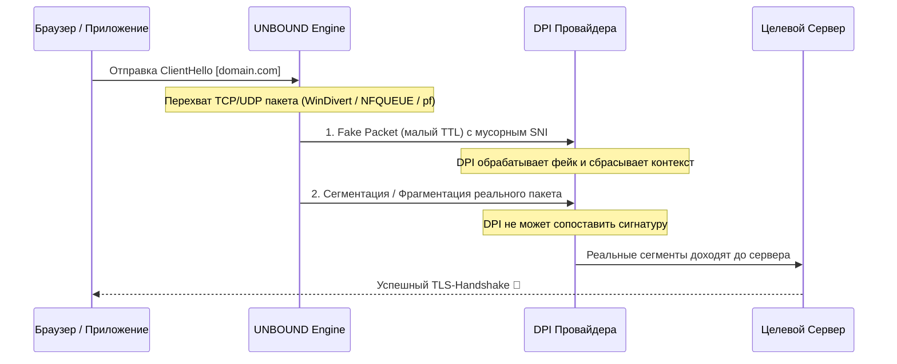

<div align="center">


# UNBOUND Refresh `v0.1.5`
**Локальный настольный оркестратор обхода DPI-блокировок для Windows, Linux и macOS.**

[](#)
[](SECURITY.md)
[](LICENSE)
[](#)

[**🛡 Безопасность и Аудит**](#-безопасность-и-гарантии-доверия) &nbsp; | &nbsp; [**⚡ Архитектура**](#-как-работает-движок) &nbsp; | &nbsp; [**🖥 Платформы**](#-поддерживаемые-платформы) &nbsp; | &nbsp; [**🛠 Сборка**](#-сборка-из-исходников)

</div>

---

## 🛡 Безопасность и Гарантии Доверия

В отличие от подозрительных форков, внедряющих поддельные SSL-сертификаты (Root CA) и перехватывающих пользовательский трафик:

- 🔒 **0% Телеметрии и 0% Аналитики**: Приложение работает 100% автономно на вашем компьютере.
- 🛑 **Без MITM и без подмены Root CA**: Ваше TLS-соединение устанавливается строго напрямую с сайтом.
- 🔑 **Контроль целостности бинарников (SHA256)**: Все бинарные файлы покрыты манифестом `engine/ENGINE_ASSETS.sha256` и проверяются на лету кнопкой в UI.
- 📄 Полный технический отчёт: [**`SECURITY.md`**](SECURITY.md) и [**`docs/SECURITY_AUDIT.md`**](docs/SECURITY_AUDIT.md).

---

## 🚀 О перезагрузке UNBOUND Refresh

Проект **UNBOUND** переведён в режим перезагрузки (**Refresh**). Старые версии (v1.x - v2.5.0) содержали множество экспериментальных, сырых и нестабильных мобильных/дополнительных целей (Android VpnService, Magisk, Steam Deck, Web Extension, OpenWrt, LG WebOS, tvOS, gh-pages). 

В рамках **Unbound Refresh**:
1. **Фокус на 3 настольных платформах**: Поддерживаются и полируются исключительно **Windows 10/11**, **Linux** и **macOS**.
2. **Очистка от мусора**: Все неработающие, сырые платформенные модули и автоматические релизы удалены из основной ветки.
3. **Архивация легаси**: Старый код версии 2.5.0 со всеми сторонними модулями сохранён в отдельной ветке `legacy/v2.x`.
4. **Сброс версионирования**: Проект переведён на чистую стартовую версию **`0.1.0-refresh`**. Готовые релизные бинарники не публикуются до завершения глубокой полировки desktop-версии.

---

## 💡 О проекте

**UNBOUND** — это инструмент десинхронизации сетевого трафика на уровне L3/L4. Он **не является VPN** или прокси-сервисом и не перенаправляет ваш трафик через внешние серверы.

Приложение перехватывает TCP/UDP-пакеты (TLS ClientHello, HTTP Host, QUIC) на лету до отправки в сеть и применяет стратегии сегментации, расщепления и подделки пакетов, заставляя системы Deep Packet Inspection (DPI) терять контекст сессии с **нулевой задержкой**.

---

## 🧩 Поддерживаемые платформы

| Платформа | Драйвер / Механизм | Статус |
| :--- | :--- | :---: |
| **Windows 10 / 11** | `WinDivert` (драйвер ядра WinWS2) | ✅ Поддерживается |
| **Linux (amd64 / arm64)** | `NFQUEUE` + `nftables` / `iptables` | ✅ Поддерживается |
| **macOS (Apple Silicon / Intel)** | `pf` divert socket (`nfqws`) | ✅ Поддерживается |

---

## ⚙️ Как работает движок


```mermaid
sequenceDiagram
    participant B as Браузер / Приложение
    participant U as UNBOUND Engine
    participant D as DPI Провайдера
    participant S as Целевой Сервер

    B->>U: Отправка ClientHello [domain.com]
    Note over U: Перехват TCP/UDP пакета (WinDivert / NFQUEUE / pf)
    U->>D: 1. Fake Packet (малый TTL) с мусорным SNI
    Note over D: DPI обрабатывает фейк и сбрасывает контекст
    U->>D: 2. Сегментация / Фрагментация реального пакета
    Note over D: DPI не может сопоставить сигнатуру
    D->>S: Реальные сегменты доходят до сервера
    S-->>B: Успешный TLS-Handshake 🚀
```

---

## 🛠 Сборка из исходников

### Требования:
- **Go** 1.25+
- **Node.js** 20+
- **Wails v2.13+**: `go install github.com/wailsapp/wails/v2/cmd/wails@v2.13.0`

### Команды сборки:

```bash
# 1. Клонирование репозитория
git clone https://github.com/bobberdolle1/unbound.git
cd unbound

# 2. Сборка фронтенда (React + Tailwind CSS)
cd frontend && npm ci && npm run build && cd ..

# 3. Сборка CLI-версии
go build -trimpath -ldflags="-s -w -X unbound/engine.Version=0.1.0-refresh" -o build/bin/unbound .

# 4. Сборка десктопного GUI (Wails)
wails build -clean -ldflags "-X unbound/engine.Version=0.1.0-refresh"
```

### Локальные проверки:
```bash
make check     # Полная локальная проверка (gofmt, vet, tests, desktop cross-compile)
make quick     # Быстрая проверка без кросс-компиляции
```

---

## 🗂 Структура репозитория и релизы

- **`master` / `main`**: Ветка Unbound Refresh (`v0.1.0-refresh`). Чистая структура, сфокусированная на Windows, Linux и macOS.
- **`legacy/v2.x`**: Заархивированная ветка предыдущего репозитория (версии v2.x) со всеми экспериментальными модулями (Android, Magisk, OpenWrt, Decky, Web Extension, LG WebOS, tvOS).

---

## 📜 Лицензия

Проект распространяется под лицензией **GPL-3.0 License**.
