<div align="center">
 
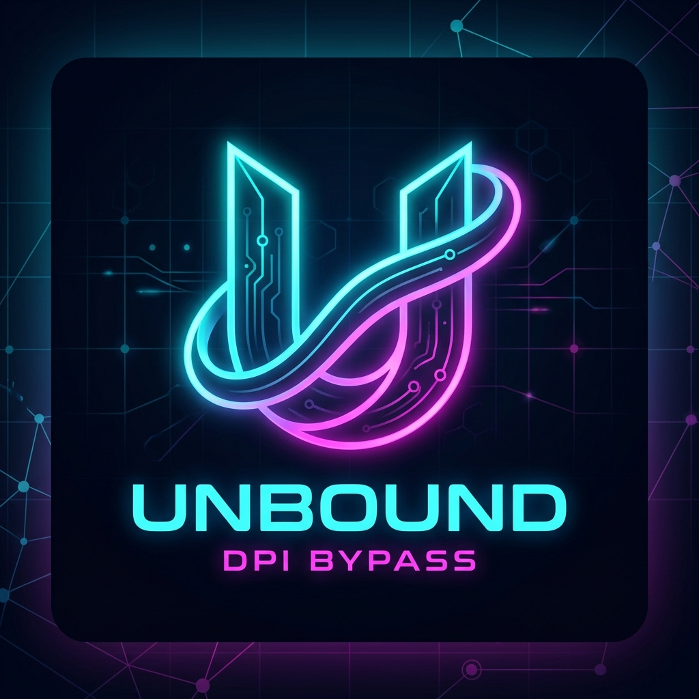
 
# 🚀 UNBOUND v2.5.0
**Мультиплатформенная пушка для прозрачного обхода DPI-блокировок.** <br>
*Zero latency. Zero overhead. Zero VPN.*
 
[](#) 
[](LICENSE)
[](#)
 
### 🎨 Галерея Тем Оформления — 12 реальных тем

<table>
  <tr>
    <td align="center"><b>Default (Standard White)</b><br>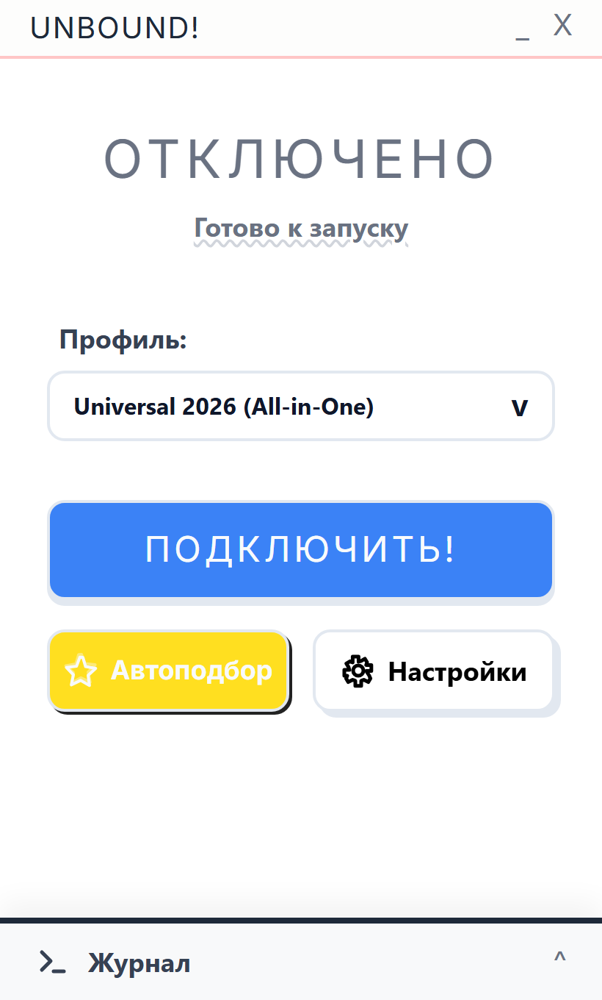</td>
    <td align="center"><b>Modern Dark</b><br>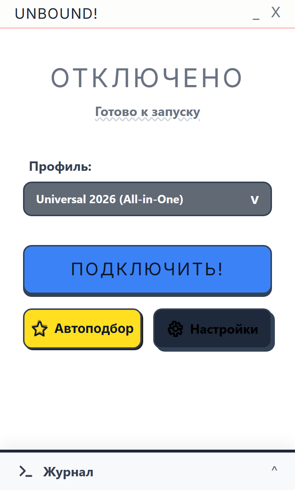</td>
    <td align="center"><b>Doodle Jump</b><br>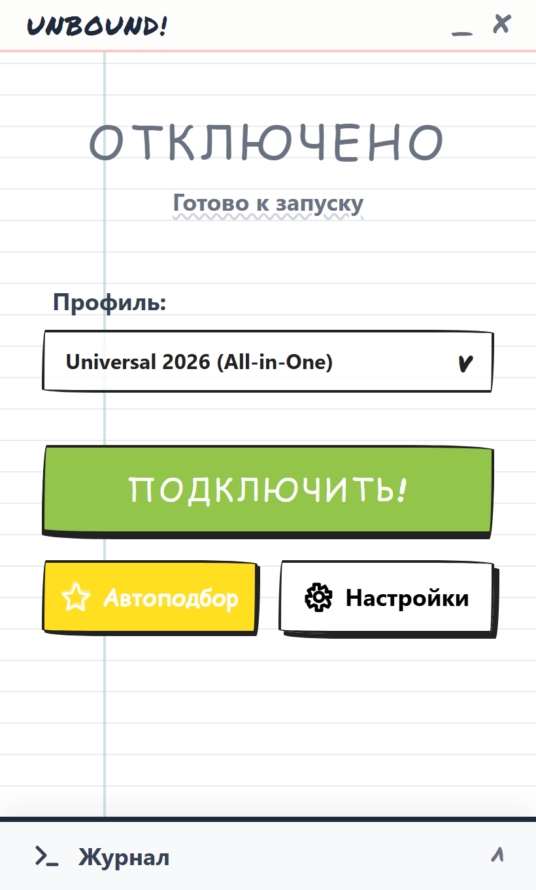</td>
    <td align="center"><b>Liquid Glass</b><br>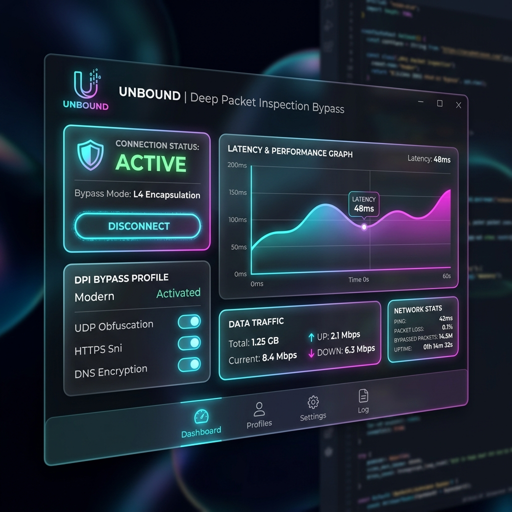</td>
  </tr>
  <tr>
    <td align="center"><b>Windows 95</b><br>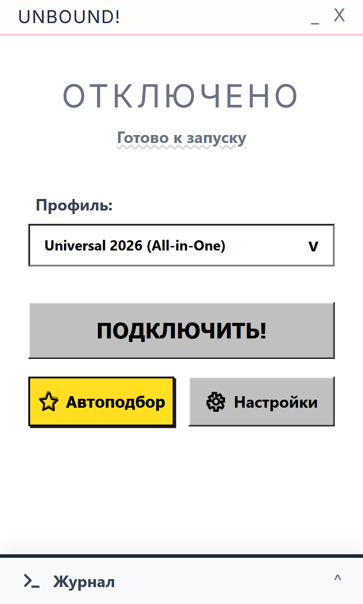</td>
    <td align="center"><b>Ghost in the Shell</b><br>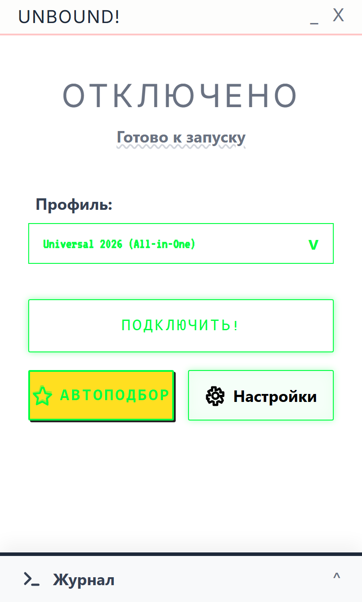</td>
    <td align="center"><b>iOS 6 Classic</b><br>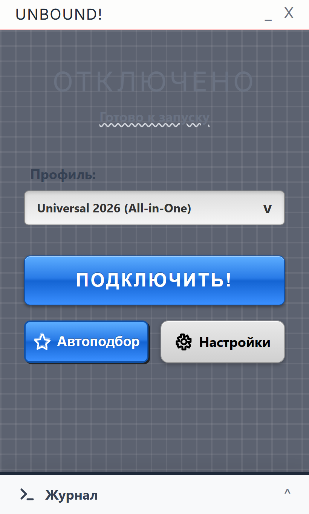</td>
    <td align="center"><b>Windows XP</b><br>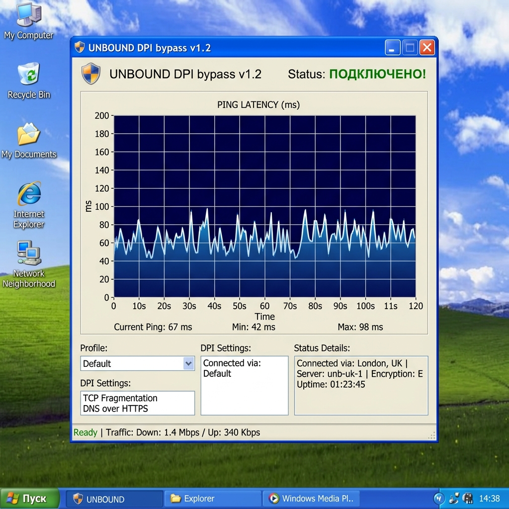</td>
  </tr>
  <tr>
    <td align="center"><b>macOS Spatial</b><br>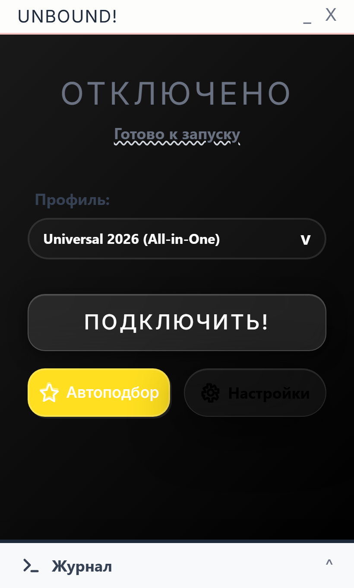</td>
    <td align="center"><b>Windows 8 Metro</b><br>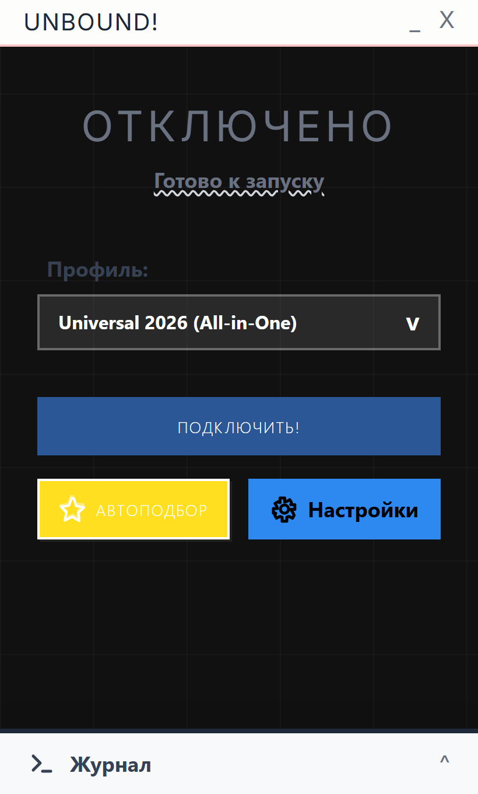</td>
    <td align="center"><b>iOS 26 Hologram</b><br>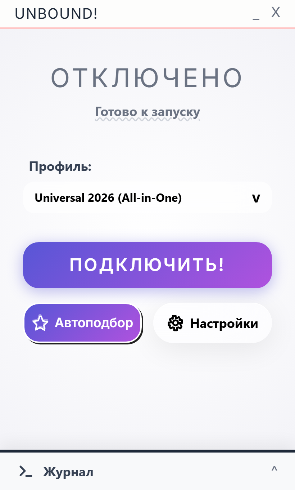</td>
    <td align="center"><b>Interstellar Gravity</b><br>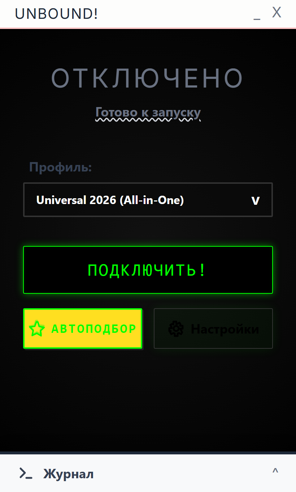</td>
  </tr>
</table>


[**🌐 Скачать**](#-поддерживаемые-платформы-и-установка) &nbsp; | &nbsp; [**✨ Архитектура**](#-как-работает-движок) &nbsp; | &nbsp; [**📖 Документация**](#-компиляция-из-исходников) &nbsp; | &nbsp; [**🖥 Официальный Сайт**](https://bobberdolle1.github.io/unbound)

> **Unbound** — это ультимативный локальный оркестратор пакетов. Он не использует VPN, удалённые серверы или внешние прокси. Программа напрямую кромсает, модифицирует и десинхронизирует TCP/UDP-трафик на уровне сетевого стека вашей ОС, заставляя системы Deep Packet Inspection (DPI) провайдера ослепнуть и пропустить вас к заблокированному ресурсу.

</div>

<br>

## 🏆 Ключевые возможности

### 💎 Премиум-интерфейс и Улучшения Windows (v2.5.0):
* **Движок Zapret 2**: Обновлено до последней стабильной версии ядра обхода `winws2.exe`, библиотек `WinDivert.dll`/`WinDivert64.sys` и набора Lua-скриптов.
* **Визуальный Конструктор LUA**: Удобный конструктор параметров десинхронизации (fake payload, desync position, TTL, DPI fooling) и текстовый редактор Lua-кода для полностью кастомных стратегий обхода.
* **Встроенный Редактор Списков**: Полноценный GUI для добавления и удаления доменов в списках `youtube.txt`, `discord.txt`, `other.txt` и `ipset-exclude.txt` без открытия текстовых файлов.
* **Защита DNS DoH**: Включение шифрования DNS-запросов через Cloudflare DNS (`1.1.1.1` и `1.0.0.1`) одной кнопкой для обхода DNS-блокировок.
* **Свечение и Аура Статуса**: Неоновые индикаторы и UAC-свечения рамки приложения, отражающие статус соединения (подключено, автонастройка, ошибка).
* **Интерактивный График Пинга**: SVG-линия задержки в реальном времени до заблокированных ресурсов.
* **Единый Пульт Управления (`unbound_control.cmd`)**: Батник для быстрого старта CLI-профилей, автозагрузки, остановки служб и редактирования списков.


<table>
  <tr>
    <td width="50%">
      <h3>⚡ Скорость провайдера</h3>
      <p>Никаких туннелей. Никакого пинга. Трафик идет напрямую до целевого сервера, гарантируя максимальную пропускную способность для загрузки 4K-видео и нулевые задержки в играх вроде Discord.</p>
    </td>
    <td width="50%">
      <h3>🛡 Полная Анонимность</h3>
      <p>В отличие от VPN-сервисов, Unbound на 100% автономен. Программа не осуществляет сбор телеметрии, не требует аккаунтов и не отправляет ваши личные данные на "анонимные" удалённые серверы.</p>
    </td>
  </tr>
  <tr>
    <td width="50%">
      <h3>🕹 Нативная интеграция</h3>
      <p>Интеграция на уровень ядра (L3/L4) с помощью встроенных драйверов WinDivert (Windows), Packet Filter (macOS) и Netfilter (Linux). Никаких виртуальных сетевых адаптеров TUN/TAP и танцев с бубном.</p>
    </td>
    <td width="50%">
      <h3>🎨 UI нового поколения</h3>
      <p>Движок управления обладает сверхбыстрым графическим интерфейсом на базе Wails с невероятными кастомными темами (Скевоморфизм, Doodle Jump, Metro UI, Liquid Glass и другие).</p>
    </td>
  </tr>
</table>

---

## 🧩 Поддерживаемые платформы и установка

| Платформа | Технология-Драйвер | Что нужно сделать | Статус |
| :--- | :--- | :--- | :---: |
|  **Windows 10/11** | `WinDivert` | Распакуйте ZIP и запустите `unbound.exe` от администратора. Движок и драйвер встроены в бинарник. | ✅ |
|  **Linux** | `NFQUEUE` + `iptables`/`nftables` | Поставьте `nfqws` (см. ниже) и запустите от `root`. | ✅ |
|  **macOS (Intel/Apple Silicon)** | `pf` + divert-socket | Поставьте `nfqws`, запустите через `sudo` и подключите pf-якорь — см. ниже. | 🧪 |
|  **Android 8.0+** | `VpnService API` | **Не работает.** Мост TUN↔прокси не реализован; приложение намеренно отказывается включать VPN — см. ниже. | ❌ |
|  **iOS (Jailbreak)** | `launchd` демон | Установите `.deb` через Sileo/Zebra (rootful / rootless). | 🧪 |
|  **OpenWRT** | `NFQUEUE` + nftables | Установите `.ipk` через `opkg install`, настройте в LuCI. Пакет собирает `nfqws` из исходников. | 🧪 |

> ✅ — работает и проверено; 🧪 — реализация есть, но на железе не проверялась; ❌ — не работает, не пытайтесь.
>
> Не перечисленные в таблице каталоги `tvos/`, `webos/` и `decky-plugin/` — заготовки разной степени готовности. tvOS в текущем виде **не соберётся**: `UnboundTunnelEngine.c` вызывает `tpws_init()` и `tpws_run_loop()`, которых нет ни в одном файле репозитория.

#### Почему Android помечен как неработающий

`UnboundVpnService` поднимает TUN-интерфейс и заворачивает в него весь трафик
(`addRoute("0.0.0.0", 0)` и `addRoute("::", 0)`), но петля пересылки пакетов не
реализована — она читает пакеты и выбрасывает их, а запуск локального прокси
целиком закомментирован. Это хуже, чем «обход не работает»: за TUN нет ничего,
поэтому **на устройстве полностью пропадает интернет** во всех приложениях,
пока VPN не выключат. При этом `BootReceiver` и `WifiStateReceiver` умеют
включать VPN сами — при загрузке и при смене Wi-Fi.

Поэтому сервис теперь **отказывается поднимать интерфейс** и сообщает причину,
вместо того чтобы оставить телефон без связи. Флаг `PACKET_RELAY_IMPLEMENTED`
в `UnboundVpnService.kt` нужно переключить в `true` тем же изменением, которое
добавит настоящий мост: либо нативная библиотека `hev-socks5-tunnel`, либо
gomobile-сборка tun2socks поверх Go-движка из этого репозитория.

📥 **Все бинарники доступны в разделе [GitHub Releases](../../releases).**

### Движок обхода на Linux и macOS

Только Windows-сборка носит движок внутри себя: `winws2.exe` и драйвер WinDivert вшиты
в бинарник. Для Linux и macOS движок `nfqws` собирается под конкретную архитектуру и
распространяется под GPL, поэтому ставится отдельно — из пакета вашего дистрибутива или
сборкой [zapret](https://github.com/bol-van/zapret) из исходников.

Unbound ищет `nfqws` в таком порядке:

1. каталог распакованных ресурсов приложения;
2. каталог рядом с исполняемым файлом (портативная установка / AppImage);
3. `$PATH`;
4. `/usr/local/bin`, `/usr/bin`, `/opt/zapret`, `/opt/zapret/binaries/x86_64`,
   `/usr/lib/zapret` (на macOS дополнительно `/opt/homebrew/bin`).

Если движок не найден, приложение всё равно запустится, а панель «Диагностика» покажет,
какие именно пути были проверены.

Дополнительно на Linux нужны ядро с модулем `nfnetlink_queue` и утилита `iptables`
**или** `nft` — что из этого доступно, Unbound определяет сам. Правила ставятся и на
IPv4, и на IPv6, иначе часть трафика прошла бы мимо обхода.

На macOS правила загружаются в отдельный pf-якорь `com.unbound.zapret`, чтобы не
затирать вашу конфигурацию из `/etc/pf.conf`. Якорь применяется, только если он
подключён в основном наборе — добавьте в `/etc/pf.conf` строку:

```
anchor "com.unbound.zapret"
```

Без неё Unbound напишет предупреждение в лог, а не сделает вид, что всё работает.

### Запуск без графического интерфейса

```bash
sudo unbound --cli                                       # первый доступный профиль
sudo unbound --cli --profile "YouTube QUIC Aggressive"
unbound --list-profiles                                  # профили, доступные на этой ОС
unbound --version
```


---

## ⚙️ Как работает движок? (Краткая архитектура)

Большинство провайдеров используют пассивные (зеркалированные) DPI или inline анализаторы пакетов. Они ищут ключевые слова вроде `googlevideo.com` при установке безопасного соединения TLS-сессии (ClientHello). 

Unbound перехватывает эти пакеты до отправки провайдеру и применяет арсенал механизмов обхода:

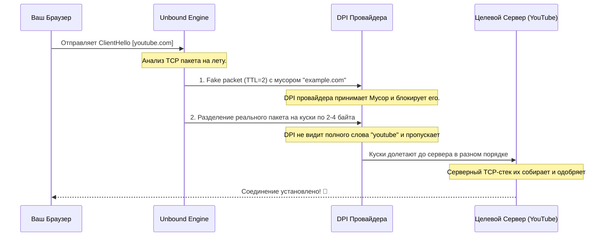
```mermaid
sequenceDiagram
    participant B as Ваш Браузер
    participant U as Unbound Engine
    participant D as DPI Провайдера
    participant S as Целевой Сервер (YouTube)

    B->>U: Отправляет ClientHello [youtube.com]
    Note over U: Анализ TCP пакета на лету.
    U->>D: 1. Fake packet (TTL=2) с мусором "example.com"
    Note over D: DPI провайдера принимает Мусор и блокирует его. 
    U->>D: 2. Разделение реального пакета на куски по 2-4 байта
    Note over D: DPI не видит полного слова "youtube" и пропускает
    D->>S: Куски долетают до сервера в разном порядке
    Note over S: Серверный TCP-стек их собирает и одобряет
    S-->>B: Соединение установлено! 🚀
```

**Ключевые методики пробития:**
1. **Дефрагментация пакета (Fragmentation):** Дробление SNI-домена (ClientHello) на мелкие TCP-сегменты, которые фильтр провайдера не может собрать воедино.
2. **Мусорная переадресация (Fake TTL):** Отсылка фальшивого пакета, жизнь которого сгорает у оператора, забивая кеш DPI-фильтра и прокладывая дорогу подлинному запросу.
3. **Рассинхрон Window Size:** Специальное манипулирование размерами TCP Window Size для обхода stateful-анализаторов пакетов.

---

## 💻 Компиляция из исходников

**Требования:**
* `Go` 1.25+ (версия задана директивой `go` в `go.mod`)
* `Node.js` 20+ — интерфейс на React + Vite + Tailwind 4
* `Wails` v2.13 — только для сборки GUI:
  `go install github.com/wailsapp/wails/v2/cmd/wails@v2.13.0`

```bash
git clone https://github.com/bobberdolle1/unbound.git
cd unbound

# 1. Сначала интерфейс: main.go встраивает frontend/dist через //go:embed,
#    поэтому без этого шага не соберётся даже headless-бинарник.
cd frontend && npm ci && npm run build && cd ..

# 2. CLI-бинарник под текущую архитектуру.
#    Обратите внимание: сборка идёт по пакету (точка), а не по одному файлу —
#    package main разложен по нескольким файлам с build-тегами на платформу.
go build -trimpath -ldflags="-s -w -X unbound/engine.Version=2.5.0" -o unbound .

# 3. GUI-приложение (Windows / macOS / Linux)
wails build -clean
```

### Проверки перед коммитом

> ⚠️ **GitHub Actions на репозитории сейчас не работает** (ограничение биллинга на уровне
> аккаунта), поэтому автоматических проверок на пуш нет. Пока это так, единственное, что
> стоит между ошибкой и веткой `master`, — прогон на своей машине.

`scripts/check.sh` повторяет `.github/workflows/ci.yml` шаг в шаг:

```bash
make check        # всё: gofmt, vet под три ОС, тесты с race, кросс-компиляция,
                  # сборка фронтенда и сайта
make quick        # то же самое без кросс-компиляции (быстрее в разы)

./scripts/check.sh go        # только Go
./scripts/check.sh frontend  # только интерфейс
./scripts/check.sh website   # только сайт
```

Скрипт возвращает ненулевой код при любой неудаче, поэтому его можно повесить на пуш:

```bash
make install-hooks    # ln -s ../../scripts/check.sh .git/hooks/pre-push
```

#### Проверка правил файрвола на живом ядре

Правила iptables/nft, которые генерирует Linux-провайдер, обычными тестами сверяются
только как строки — так не поймать спецификацию, которую отвергнет ядро. Отдельный
набор тестов скармливает сгенерированные правила настоящему `iptables` и `nft`:

```bash
sudo UNBOUND_FIREWALL_TEST=1 go test ./engine/providers/ -run Live -v
```

Тесты требуют root и явного `UNBOUND_FIREWALL_TEST=1`, поэтому обычный `go test ./...`
их пропускает. Правила ставятся в отдельную цепочку, в которую никто не переходит,
так что ни один пакет под них не попадает, а цепочка удаляется после прогона.
`./scripts/check.sh` запускает их автоматически, если работает от root на Linux.

Отдельные команды, если нужно руками:

```bash
gofmt -l .            # должно быть пусто
go vet ./...
go test -race ./...

# сборка под другую платформу — ловит ошибки в build-тегах
GOOS=windows go vet ./...
GOOS=darwin  go vet ./...
```

### Релизы и сайт без Actions

Пока Actions недоступны, `release.yml` и `pages.yml` не запускаются. Делать вручную:

```bash
make build                    # CLI-бинарник под текущую платформу
make gui                      # десктопное приложение через Wails
./build_all.sh <target>       # сборка под конкретную платформу, см. --help

make deploy-site              # опубликовать сайт в ветку gh-pages
```

Когда биллинг починится, всё это начнёт делаться автоматически — workflow'ы уже в
репозитории и трогать их не потребуется.

> **Важно:** Инструкции по сборке пакетов для *iOS (theos)*, *Android (gradle)* и *OpenWRT* лежат в соответствующих папках: `/theos`, `/android`, `/openwrt`.

---

## 📜 Поддержать проект

Исходный код распространяется под лицензией **GPL-3.0 License**. Модификации, форки и коммерция разрешены.
Если проект был полезен — **поставьте ему ⭐ на GitHub**, это здорово помогает развитию!

<div align="center">
    <br>
    <i>Разработано с любовью к свободному интернету.</i>
</div>
