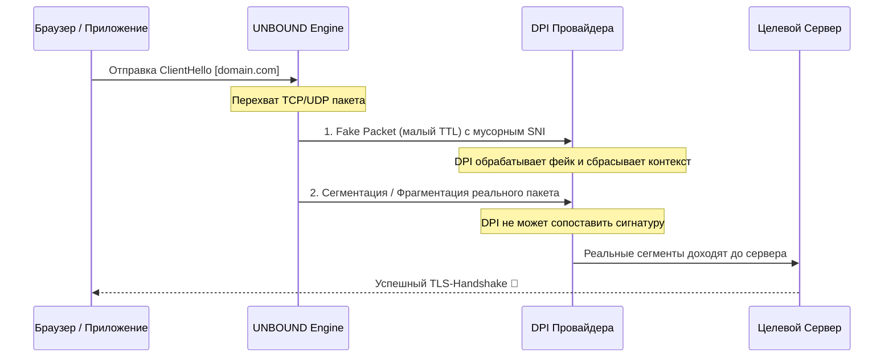

<div align="center">


# UNBOUND v2.5.0
**Мультиплатформенный прозрачный оркестратор для обхода DPI-блокировок.**

[](#)
[](LICENSE)
[](#)

[**🌐 Скачать**](#-поддерживаемые-платформы) &nbsp; | &nbsp; [**⚡ Архитектура**](#-как-работает-движок) &nbsp; | &nbsp; [**📖 Инструкции**](#-компиляция-из-исходников) &nbsp; | &nbsp; [**🖥 Сайт**](https://bobberdolle1.github.io/unbound)

</div>

---

## 💡 О проекте

**UNBOUND** — это локальный инструмент прозрачной десинхронизации сетевого трафика. Он **не является VPN** или прокси-сервисом и не перенаправляет ваш трафик на сторонние серверы. 

Приложение работает непосредственно на сетевом стеке вашей операционной системы (L3/L4), модифицируя TCP/UDP-пакеты (TLS ClientHello, HTTP Host, QUIC) на лету. Это заставляет системы Deep Packet Inspection (DPI) операторов связи терять контекст сессии и пропускать запросы к заблокированным ресурсам с **нулевой дополнительной задержкой**.

---

## 🏆 Ключевые особенности

- ⚡ **Zero Latency & Max Speed**: Прямое соединение с целевым сервером без промежуточных нод.
- 🛡 **100% Автономность**: Отсутствие централизованных серверов, телеметрии и учетных записей.
- 🔌 **Поддержка Zapret 2 Engine**: Перехват и модификация пакетов через `winws2` (Windows) и `nfqws` (macOS/Linux/Android/OpenWrt).
- 🎛 **Гибкая настройка LUA-стратегий**: Конструктор параметров десинхронизации (Fake Packet, Split Position, TTL Fooling) и текстовый редактор скриптов.
- 🌐 **Защищенный DNS (DoH)**: Встроенное шифрование DNS-запросов через Cloudflare DNS (`1.1.1.1`).
- 🎨 **Минималистичный UI**: Лаконичный современный интерфейс на базе Wails & React с темами Modern Dark, Modern Light и macOS Glass.

---

## 🧩 Поддерживаемые платформы

| Платформа | Драйвер / Механизм | Метод установки | Статус |
| :--- | :--- | :--- | :---: |
| **macOS (Apple Silicon / Intel)** | `pf` (divert socket) | Установите `nfqws`, подключите `pf`-якорь и запустите через `sudo` | 🧪 |
| **Windows 10 / 11** | `WinDivert` | Запустите `unbound.exe` от имени Администратора | ✅ |
| **Linux** | `NFQUEUE` + `iptables`/`nftables` | Установите `nfqws` и запустите с правами `root` | ✅ |
| **Android 8.0+** | `VpnService` / `Magisk` | APK (без Root через JNI TUN) или Magisk/KernelSU модуль с WebUI | ✅ |
| **OpenWRT** | `NFQUEUE` + `nftables` | Сборка `.ipk` пакета и управление через LuCI | 🧪 |
| **iOS / tvOS** | `launchd` + `tpws` | В разработке (требует адаптации `tpws_init` цикла) | ❌ |

> ✅ — Проверено и стабильно &nbsp;|&nbsp; 🧪 — Готово, требует тестирования &nbsp;|&nbsp; ❌ — В разработке

---

## ⚙️ Как работает движок

Системы DPI провайдеров анализируют заголовки сетевых пакетов (например, имя домена в TLS ClientHello). UNBOUND перехватывает эти пакеты до отправки и применяет комбинации стратегий:


```mermaid
sequenceDiagram
    participant B as Браузер / Приложение
    participant U as UNBOUND Engine
    participant D as DPI Провайдера
    participant S as Целевой Сервер

    B->>U: Отправка ClientHello [domain.com]
    Note over U: Перехват TCP/UDP пакета
    U->>D: 1. Fake Packet (малый TTL) с мусорным SNI
    Note over D: DPI обрабатывает фейк и сбрасывает контекст
    U->>D: 2. Сегментация / Фрагментация реального пакета
    Note over D: DPI не может сопоставить сигнатуру
    D->>S: Реальные сегменты доходят до сервера
    S-->>B: Успешный TLS-Handshake 🚀
```

---

## 🖥 Сборка из исходников

### Требования:
- **Go** 1.25+
- **Node.js** 20+
- **Wails v2.13+**: `go install github.com/wailsapp/wails/v2/cmd/wails@v2.13.0`

### Команды сборки:

```bash
# 1. Клонирование репозитория
git clone https://github.com/bobberdolle1/unbound.git
cd unbound

# 2. Сборка фронтенда
cd frontend && npm ci && npm run build && cd ..

# 3. Сборка CLI-версии
go build -trimpath -ldflags="-s -w -X unbound/engine.Version=2.5.0" -o build/bin/unbound .

# 4. Сборка десктопного GUI (Wails)
wails build -clean -ldflags "-X unbound/engine.Version=2.5.0"
```

### Локальные проверки:
```bash
make check     # Полная проверка (vet, tests, cross-compile)
make quick     # Быстрая проверка без кросс-компиляции
```

---

## 📜 Лицензия

Проект распространяется под лицензией **GPL-3.0 License**.

<div align="center">
    <br>
    <i>UNBOUND — Свободный и открытый интернет без костылей.</i>
</div>
