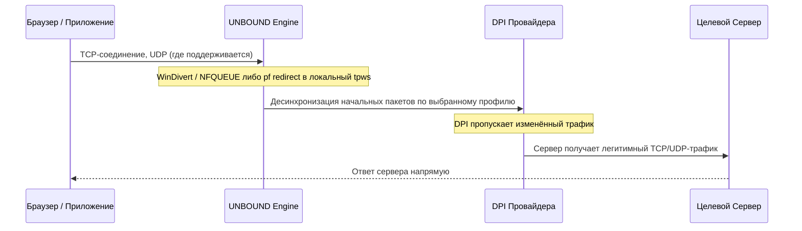

<div align="center">


# UNBOUND `v0.8.0`
**Исходный код релиза `v0.8.0`. Релиз `v0.8.0` подготовлен, но ещё не опубликован: сборка macOS заблокирована недоступностью лаборатории.**

[](#)
[](#)
[](SECURITY.md)
[](LICENSE)

[**🔒 Безопасность**](#-безопасность-и-гарантии-доверия) &nbsp; | &nbsp; [**🖥️ Интерфейс**](#-интерфейс-и-дизайн-системы) &nbsp; | &nbsp; [**⚡ Архитектура**](#-как-работает-движок) &nbsp; | &nbsp; [**📦 Сборка**](#-сборка-из-исходников)

</div>

---

## 🎨 Интерфейс и Дизайн-Система (Precision Monochrome)

В релизе **v0.3.0** фронтенд приложения полностью переработан в рамках концепции **Precision Monochrome** — строгого, чистого и дорогого десктопного минимализма:

- **0% лишнего неона и декоративных градиентов**: Выдержанная индустриальная палитра на основе глубокого обсидиана, графита и пастельной бумаги.
- **Точечное использование цвета**: Семантические статус-диоды (зелёный — активен, жёлтый — подключение, красный — ошибка, серый — остановлен).
- **Платформ-ориентированная шапка**: macOS светофоры слева, Windows 11 Fluent контролы справа, нейтральная Linux-панель.
- **Интегрированные темы**:
  - **`Monolith`**: Минималистичный монохромный обсидиан (`#08090b`).
  - **`Paper`**: Тёплая студийная светлая тема (`#f5f4f0`).
  - **`Graphite`**: Металлическая серо-стальная тема (`#121417`) со стальными рамками.

---

## ⚙️ Ключевые возможности

- **Актуальный движок**: bundled **Zapret 2 v1.0.5** (`winws2.exe` / `nfqws2`) с Lua-стратегиями; на macOS — `tpws` через `pf`-якорь.
- **Strategy Lab (Лаборатория поиска)**: инструмент изолированного поиска неизвестных работающих стратегий на базе алгоритмов BlockCheck2. Применяет строгий фильтр WinDivert `--wf-raw-filter` только к IP-адресам тестируемой цели (нулевое влияние на остальной трафик ПК) и валидирует результаты через Connectivity Engine с возможностью сохранения в пользовательский профиль.
- **Адаптивный профиль (Adaptive Experimental)**: динамическая оркестрация на базе `zapret-auto.lua` (`circular`), плавно переключающая стратегии для конкретных доменов по подтверждённым сбоям без глобального захвата лишнего трафика.
- **AutoHostlist**: динамическое пополнение списка заблокированных доменов по обратной связи сети (`--hostlist-auto` в `autodetect.txt`) с управлением, очисткой и переносом доменов в постоянные списки через интерфейс.
- **AutoTune vNext**: доказательный замкнутый цикл для одного нормализованного hostname и его ограниченной текущей DNS-области, а также инфраструктура ограниченного проверенного ServiceGraph (до 4 явных точных узлов-хостов, до 8 текущих точных адресов на хост) с независимой привязкой каждого хоста, Apply/ManagedHealth, сохранением и перезапуском. Автоматическое обнаружение сервисного графа и браузерный discovery не реализованы. Использует свежую проверку каждого edge, точный управляемый захват, транзакционные Apply/Suspend/Revert и редактированную историю результатов, которая может менять порядок допустимых кандидатов, но не может выдавать допустимость или полномочия Apply. Полное многохостовое/video-покрытие YouTube и доказательства QUIC/UDP vNext не заявляются.
- **Central Operation Coordinator**: центральный координатор исключительных операций, защищающий от параллельного запуска конфликтующих сетевых задач (Doctor, AutoTune, Lab, A/B).
- **UNBOUND Doctor**: двухуровневая асинхронная диагностика (быстрая и расширенная) состояния ядра, системных привилегий, сетевого стека, конфликтующих программ и сервисов YouTube, Discord (включая проверку WebSocket Gateway без токенов) и Steam.
- **Сравнение A/B (Bypass Comparison)**: транзакционный тест эффективности профиля относительно прямого доступа без обхода с гарантированным откатом состояния.
- **Самовосстановление автозапуска (Self-Healing)**: автоматическое обновление пути к `unbound.exe` в Планировщике задач Windows при распаковке приложения в новую папку.
- **Update Manager с защитой и откатом**: раздельный аудит версий (приложение, движок, стратегии, списки), проверка SHA256 и безопасный rollback при сбое валидации движка.
- **Steam-совместимость**: Steam-домены и сети Valve защищены от десинхронизации, которая ломала клиент; игровой трафик обрабатывается opt-in профилем.
- **Тихий старт и трей**: при автозапуске вместе с Windows окно не показывается вообще (`StartHidden`); управление и статус — из трея с нулевым числом холостых мутаций.
<div align="center">
  <p><em>Скриншоты интерфейса будут добавлены после завершения платформенной валидации.</em></p>
</div>

---

## 🔒 Безопасность и Гарантии Доверия

В отличие от сервисов, внедряющих поддельные SSL-сертификаты (Root CA) и перехватывающих пользовательский трафик:

- 🛡️ **Без телеметрии и аналитики**: приложение не отправляет метрики или историю посещений.
- 🔑 **Без MITM и подмены Root CA**: TLS-соединение устанавливается напрямую с целевым узлом.
- 📜 **Контроль целостности бинарников (SHA256)**: Все бинарные активы покрыты манифестом `engine/ENGINE_ASSETS.sha256` и проверяются в UI.
- 📋 Полный технический отчёт: [**`SECURITY.md`**](SECURITY.md) и [**`docs/SECURITY_AUDIT.md`**](docs/SECURITY_AUDIT.md).

---

## 🛠️ О проекте

**UNBOUND** — это инструмент десинхронизации сетевого трафика на уровне L3/L4. Он **не является VPN** или прокси-сервисом и не перенаправляет ваш трафик через внешние серверы.

На Windows и Linux приложение перехватывает TCP/UDP-пакеты и применяет стратегии Zapret 2 (`winws2` / `nfqws2`). На macOS используется локальный прозрачный TCP-прокси `tpws` через изолированный `pf`-якорь.

---

## 🖥️ Поддерживаемые платформы

| Платформа | Драйвер / Механизм | Статус проверки |
| :--- | :--- | :---: |
| **Windows 11 x64 (`windows/amd64`)** | `WinDivert` + Zapret 2 `winws2.exe` | ✅ Проверены runtime и сеть |
| **macOS Apple Silicon (`darwin/arm64`)** | `pf` redirect + Zapret `dvtws` / `tpws` | ✅ Проверен runtime |
| **macOS Intel (`darwin/amd64`)** | `pf` redirect + Zapret `dvtws` / `tpws` | ⚠️ Не проверено |
| **Linux amd64 (`linux/amd64`)** | `NFQUEUE` + `nftables` / `iptables` + `nfqws2` | 🟡 Экспериментальный; физически принят NFQUEUE/nft runtime и multi-host graph; публичный CLI-only артефакт `unbound-v0.8.0-linux-amd64.tar.gz` |
| **Linux arm64 (`linux/arm64`)** | `NFQUEUE` + `nftables` / `iptables` + `nfqws2` | 🟡 Экспериментальный; публичный артефакт не собирается и не публикуется |

## ⚡ Как работает движок


```mermaid
sequenceDiagram
    participant B as Браузер / Приложение
    participant U as UNBOUND Engine
    participant D as DPI Провайдера
    participant S as Целевой Сервер

    B->>U: TCP-соединение, UDP (где поддерживается)
    Note over U: WinDivert / NFQUEUE либо pf redirect в локальный tpws
    U->>D: Десинхронизация начальных пакетов по выбранному профилю
    Note over D: DPI пропускает изменённый трафик
    D->>S: Сервер получает легитимный TCP/UDP-трафик
    S-->>B: Ответ сервера напрямую
```

---

## 💻 Использование CLI и Запускные Скрипты

Помимо десктопного GUI, UNBOUND поддерживает консольный режим и запускные скрипты для **macOS**, **Windows** и **Linux**.

### Интерактивный CLI (`unbound --control`)
```bash
# Запуск консольного центра управления
sudo ./unbound --control
```

### Запуск по профилю (`--profile`)
```bash
sudo ./unbound --cli --profile ultimate   # macOS/Linux
sudo ./unbound --cli --profile rec        # Windows: Recommended
```

### Экспериментальный Linux `amd64` архив

Релиз `v0.8.0` — первый, в котором публикуется CLI-only архив `unbound-v0.8.0-linux-amd64.tar.gz`; Linux GUI в него не входит. Для перехвата нужны `x86_64` Linux, root, ядро с `NFQUEUE` и предпочтительно `nft` (`iptables` — fallback). После распаковки сначала проверьте `./unbound --version --json` и `./unbound --list-profiles --json`; запуск профиля выполняйте только из повышенного терминала. Linux-артефакт остаётся **EXPERIMENTAL** и не гарантирует доступность конкретного сервиса или дистрибутива.

---

## 📦 Сборка из исходников

### Требования:
- **Go** 1.25+
- **Node.js** 22+
- **Wails v2.13+**: `go install github.com/wailsapp/wails/v2/cmd/wails@v2.13.0`

### Команды сборки:

```bash
# 1. Клонирование репозитория
git clone https://github.com/bobberdolle1/unbound.git
cd unbound

# 2. Сборка фронтенда
cd frontend && npm ci && npm run build && cd ..

VERSION="$(node -p "require('./wails.json').info.productVersion")"
go build -trimpath -ldflags="-s -w -X unbound/engine.Version=$VERSION" -o build/bin/unbound .
# 4. Сборка Wails GUI
wails build -clean -ldflags "-X unbound/engine.Version=$VERSION"
---

## ⚖️ Лицензия & Отказы

Распространяется на условиях лицензии **GPL-3.0**. Все права на сторонние бинарники (Zapret / WinDivert / tpws) принадлежат их авторам и лицензированы отдельно (`LICENSE`, `ZAPRET_LICENSE.txt`).
