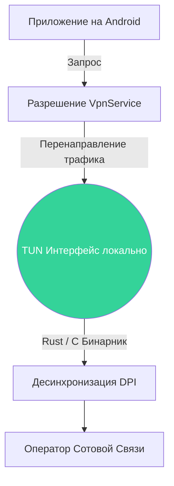

# 🤖 Unbound Android — Нативный VpnService Клиент

Официальный Android-клиент для архитектуры Unbound. Приложение использует встроенный в Android API `VpnService` для перехвата и локальной модификации трафика без необходимости Root-прав (за исключением системных модулей Magisk).

---

## 🔬 Архитектура под Андроидом

Android-система запрещает прямой доступ к сетевым интерфейсам (`wlan0`, `rmnet0`), поэтому используется виртуальный TUN-интерфейс (через `VpnService`).



Трафик проходит через локальный дескриптор TUN, где нативный C/Rust движок модифицирует TLS потоки и возвращает их в сеть. Ваш настоящий IP-адрес остается неизменным.

---

## 🚀 Установка (Без Root)

Все готовые APK-файлы находятся на [странице релизов GitHub](https://github.com/bobberdolle1/unbound/releases).

1. Скачайте актуальный `Unbound-Android-v2.0.0.apk`.
2. Установите приложение (разрешите установку из неизвестных источников).
3. При запуске выдайте разрешение на создание VPN.
4. Нажмите «Запуск».

---

## 🔥 Сборка из исходников (Для разработчиков)

Проект полностью построен с использованием системы сборки **Gradle** и нативного **NDK** (Native Development Kit) для компиляции движков обхода DPI на архитектуру ARM64.

### Требования
* Android Studio Iguana (или новее)
* Android SDK 34
* Android NDK `25.1.8937393`
* CMake 3.22.1

### Инструкция по сборке

1. Откройте директорию `android/` в Android Studio.
2. Studio автоматически синхронизирует зависимости Gradle.
3. Убедитесь, что SDK/NDK пути прописаны в `local.properties`:
   ```properties
   sdk.dir=/Users/вашеимя/Library/Android/sdk
   ndk.dir=/Users/вашеимя/Library/Android/sdk/ndk/25.1.8937393
   ```
4. Соберите проект:
   ```bash
   ./gradlew assembleRelease
   ```
   *Готовый APK будет лежать в `app/build/outputs/apk/release/app-release.apk`.*

---

## ⚡️ Magisk Модуль (Альтернатива)

Для тех, кто предпочитает работу на 100% уровне ядра без создания фонового VPN.

Мы поставляем `unbound-magisk-v2.0.0.zip` в официальном релизе. 
* Установка 1: Зайдите в Magisk Manager -> Модули -> Установить из хранилища.
* Установка 2: Выберите ZIP архив и перезагрузите девайс.
* Трафик фильтруется прозрачно с помощью бинарников `iptables/nfqws`.

> [!WARNING]
> Версия Magisk требует Root-пава и Android 8.0+. Используйте её на свой страх и риск.

---
**Лицензия**: GPL-3.0
