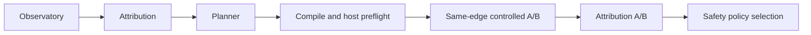

# AutoTune vNext

AutoTune vNext is an evidence-driven, bounded StrategyIR experiment engine. It is separate from legacy AutoTune and does not change the existing UI or `RunAutoTuneV3` behavior.

## Legacy and vNext

Legacy AutoTune benchmarks named legacy profiles and selects by its score-oriented profile logic.

vNext starts with explicit target evidence and only considers caller-supplied, validated StrategyIR candidates that Planner marks `ELIGIBLE`. It does not enumerate the legacy profile catalog, infer semantics from profile names, or treat a successful HTTP request alone as a bypass result.

## Controlled experiment

The request explicitly supplies a target, optional protected controls, StrategyIR candidates, backend, scope snapshot, network label, evidence options, and a policy. The policy has explicit defaults for candidate count, total duration, and per-observation timeout.

Initial direct discovery may resolve normally. Once it chooses an edge, every candidate comparison pins direct-before, active, and direct-after observations to that exact resolved IP. TLS SNI stays the hostname and HTTP Host stays the original authority. A different edge, address family, target, protocol, or incompatible network context is `INCONCLUSIVE`, not a candidate failure.

A candidate is `VERIFIED_FIXED` only when all of these hold:

1. direct-before fails;
2. the active candidate path succeeds;
3. direct-after fails again;
4. Attribution can make the same-edge `FIXED_BY_PROFILE` comparison;
5. no healthy protected control breaks while the candidate is active; and
6. lifecycle cleanup succeeds.

`ELIGIBLE` means structurally applicable, not effective. `VERIFIED_FIXED` applies only to the tested edge and context, not a service universally. `SELECTED` means the deterministic safety-first policy chose one verified candidate; it does not activate it permanently.

## Gates and policy

Planner is the only eligibility authority. The core recompiles an eligible StrategyIR candidate and fails closed if its compile status, backend, or fingerprint disagrees with Planner. A narrow host-preflight boundary checks factual runtime readiness, including logical assets and capture requirements, without making a network-effectiveness probe.

Only verified candidates enter selection. Order is deterministic and safety-first: target-only, non-experimental, Steam-safe, non-target-TLS-safe, lower declared aggressiveness, then stable ID/fingerprint. Latency is observational only and is never a winner criterion. Duplicate fingerprints run once. `MaxCandidates` counts candidates that reach direct-before experiment execution; compile, trusted-asset materialization, and host-preflight rejections do not consume it. Candidates outside the configured budget are recorded as `NOT_RUN_BUDGET`.

## Transactional machine state

An executor owns platform mutation. The core requires snapshot, direct-state establishment, activation and verification, deactivation, restoration, and restoration verification. A candidate session owns exactly one bounded `Deactivate` call after `Activate` is attempted, even when activation partially fails or the experiment context is cancelled. Any activation, verification, teardown, or direct-state re-establishment failure is terminal: no later candidate executes, and final restore still runs. Cancellation enters cleanup. Result precedence is `STATE_RESTORE_FAILED`, then `LIFECYCLE_FAILED`, then `CANCELLED`; `PREFLIGHT_FAILED` describes runs where no candidate reached execution because preflight rejected them. A failed restore or failed restore verification produces `STATE_RESTORE_FAILED` and clears any selected strategy.

## Exact execution boundaries

The executor receives the compiler's materialized `EngineArgv`, structured `CapturePlan`, and resolved trusted asset handles. StrategyIR contains logical IDs only. The closed resolver supplies each typed asset's opaque `EngineValue`; materialization substitutes exact `${asset:<id>}` tokens without shell parsing, environment expansion, or argv concatenation. Every token must resolve to the compiler-required kind (`BLOB_SYMBOL`, `HOSTLIST_FILE`, `IPSET_FILE`, or `AUTO_HOSTLIST_FILE`), and no unresolved token reaches an exact platform plan.

Linux keeps NFQUEUE capture separate from `nfqws2` engine argv; `--wf-*` cannot leak into Linux engine arguments and generic legacy capture widening is prohibited. A Linux physical adapter accepts only one factual outbound TCP target edge and address family, creates a randomly named owned `ip` or `ip6` NFQUEUE table/rule, uses a random unclaimed queue in the 40000–59999 range, verifies the marker and queue in the kernel ruleset before observing traffic, and removes that owned rule/table before restoration. Mark exclusion prevents recursively queuing the engine's own marked traffic. `nfqws2` is launched in an owned process group and is terminated before rule removal.

Windows derives a raw WinDivert filter from the factual target edge plus the compiled address family, direction, transport, and ports; it does not resolve DNS during activation. The adapter passes that raw filter alongside compiler-rendered capture argv, accepts readiness only after the canonical `windivert initialized. capture is started.` marker, and attaches the owned `winws2` process to a `KILL_ON_JOB_CLOSE` job object. The job is closed during teardown, so an owned candidate cannot survive the parent process. Neither adapter uses the legacy provider's broad capture defaults for a vNext candidate.

Both adapters use only extracted, hash-verified product assets and the pinned engine hash. Their host preflight fails closed for missing privilege, asset identity failure, missing capture tooling, timestamp requirements, ownership collision, or an already-active vNext process. Lifecycle logs contain only experiment identity, backend, strategy/fingerprint, selected edge, lifecycle phase, PID, and bounded failure detail; they exclude URLs, headers, credentials, packet data, and unrelated process listings.

macOS tpws uses SOCKS. The default direct Observatory dialer does not prove it traversed SOCKS, so vNext marks macOS tpws experiment measurement as `MEASUREMENT_PATH_UNSUPPORTED` until an explicit provider-neutral SOCKS-aware Observatory connector exists. It does not rely on a system proxy.
