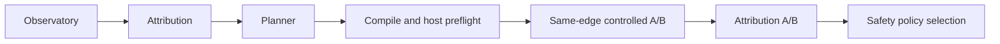

# AutoTune vNext

AutoTune vNext is the primary evidence-driven, bounded StrategyIR product flow. Legacy AutoTune remains an explicitly labeled compatibility path; `RunAutoTuneV3` behavior is unchanged.

## Legacy and vNext

Legacy AutoTune benchmarks named legacy profiles and selects by its score-oriented profile logic.

vNext starts with explicit target evidence and only considers caller-supplied, validated StrategyIR candidates that Planner marks `ELIGIBLE`. It does not enumerate the legacy profile catalog, infer semantics from profile names, or treat a successful HTTP request alone as a bypass result.

## V2.1 observatory evidence

V2.1 adds additive, versioned `ProbeSpec` and `EvidenceRecord` contracts around the existing `ObservationResult`; it does not alter V1 attribution, Planner eligibility, controlled A/B execution, or managed lifecycle. TCP/HTTPS evidence is implemented through the current observer. QUIC and UDP remain explicit unsupported measurements. See [V2.1 observatory evidence](observatory-evidence-v2.md) for contract, privacy, transfer, and terminology limits.

## Controlled experiment

The request explicitly supplies a target, optional protected controls, StrategyIR candidates, backend, scope snapshot, network label, evidence options, and a policy. The policy has explicit defaults for candidate count, total duration, and per-observation timeout.

Initial direct discovery may resolve normally. Once it chooses an edge, every candidate comparison pins direct-before, active, and direct-after observations to that exact resolved IP. TLS SNI stays the hostname and HTTP Host stays the original authority. A different edge, address family, target, protocol, or incompatible network context is `INCONCLUSIVE`, not a candidate failure.

A candidate is `VERIFIED_FIXED` only when all of these hold:

1. direct-before fails;
2. the active candidate path succeeds;
3. direct-after fails again;
4. Attribution can make the same-edge `FIXED_BY_PROFILE` comparison;
5. no healthy protected control breaks while the candidate is active; and
6. lifecycle cleanup succeeds.

`ELIGIBLE` means structurally applicable, not effective. `VERIFIED_FIXED` applies only to the tested edge and context, not a service universally. `SELECTED` means the deterministic safety-first policy chose one verified candidate; it does not activate it permanently.

## Gates and policy

Planner is the only eligibility authority. The core recompiles an eligible StrategyIR candidate and fails closed if its compile status, backend, or fingerprint disagrees with Planner. A narrow host-preflight boundary checks factual runtime readiness, including logical assets and capture requirements, without making a network-effectiveness probe.

Only verified candidates enter selection. Order is deterministic and safety-first: target-only, non-experimental, Steam-safe, non-target-TLS-safe, lower declared aggressiveness, then stable ID/fingerprint. Latency is observational only and is never a winner criterion. Duplicate fingerprints run once. `MaxCandidates` counts candidates that reach direct-before experiment execution; compile, trusted-asset materialization, and host-preflight rejections do not consume it. Candidates outside the configured budget are recorded as `NOT_RUN_BUDGET`.

## Transactional machine state

An executor owns platform mutation. The core requires snapshot, direct-state establishment, activation and verification, deactivation, restoration, and restoration verification. A candidate session owns exactly one bounded `Deactivate` call after `Activate` is attempted, even when activation partially fails or the experiment context is cancelled. A teardown failure retains the owned candidate record; restore retries cleanup and restoration verification fails until process and capture absence are factually audited. Any activation, verification, teardown, or direct-state re-establishment failure is terminal: no later candidate executes, and final restore still runs. Cancellation enters cleanup. Result precedence is `STATE_RESTORE_FAILED`, then `LIFECYCLE_FAILED`, then `CANCELLED`; `PREFLIGHT_FAILED` describes runs where no candidate reached execution because preflight rejected them. A failed restore or failed restoration audit is never reported as `StateRestored=true`.

## Exact execution boundaries

The executor receives the compiler's materialized `EngineArgv`, structured `CapturePlan`, and resolved trusted asset handles. StrategyIR contains logical IDs only. The closed resolver supplies each typed asset's opaque `EngineValue`; materialization substitutes exact `${asset:<id>}` tokens without shell parsing, environment expansion, or argv concatenation. Every token must resolve to the compiler-required kind (`BLOB_SYMBOL`, `HOSTLIST_FILE`, `IPSET_FILE`, or `AUTO_HOSTLIST_FILE`), and no unresolved token reaches an exact platform plan.

Linux keeps NFQUEUE capture separate from `nfqws2` engine argv; `--wf-*` cannot leak into Linux engine arguments and generic legacy capture widening is prohibited. A Linux physical adapter accepts only one factual outbound TCP target edge and address family, creates a randomly named owned `ip` or `ip6` NFQUEUE table/rule, uses a random unclaimed queue in the 40000–59999 range, verifies the marker and queue in the kernel ruleset before observing traffic, and removes that owned rule/table before restoration. Rule ownership is recorded immediately after installation, before `nfqws2` start. A process start, early exit, verification, or activation-context failure runs bounded uncancelled rollback; a failed rule deletion remains tracked for restore retry. Iptables ownership discovery includes both `iptables` and `ip6tables` when present; queue ownership uses exact NFQUEUE syntax and the nfnetlink queue registry when available. The rule is created by one nft batch, and cleanup verifies exact absence rather than trusting a command return. Mark exclusion and `queue-bypass` prevent recursive interception and fail open on a stale rule. `nfqws2` runs in an owned process group with Linux parent-death `SIGTERM`.

Windows derives a raw WinDivert filter from the factual target edge plus the compiled address family and ports; it does not resolve DNS during activation. The typed `CapturePlan` remains the semantic capture direction authority. Since `--wf-raw-filter` is ANDed with the WinDivert constructor, its TCP endpoint guard includes exact outbound destination and inbound source endpoint forms so constructor-required SYN+ACK, FIN, and RST traffic is preserved without broadening to another edge or port. A spawned PID is recorded before job attachment; attachment failure uses bounded teardown and retains the PID if exit cannot be proven. The adapter drains stdout and stderr after the canonical `windivert initialized. capture is started.` readiness marker, and attaches the owned `winws2` process to a `KILL_ON_JOB_CLOSE` job object. Ownership is cleared only after an actual process-exit audit. Candidate execution inherits the caller experiment deadline; bounded timeouts apply only to teardown. Physical vNext target guards support TCP only. Neither adapter uses the legacy provider's broad capture defaults for a vNext candidate.

Both adapters use only extracted, hash-verified product assets and the pinned engine hash. Their host preflight fails closed for missing privilege, asset identity failure, missing capture tooling, timestamp requirements, ownership collision, or an already-active vNext process. Lifecycle logs contain only experiment identity, backend, strategy/fingerprint, selected edge, lifecycle phase, PID, and bounded failure detail; they exclude URLs, headers, credentials, packet data, and unrelated process listings.

macOS tpws uses SOCKS. The default direct Observatory dialer does not prove it traversed SOCKS, so vNext marks macOS tpws experiment measurement as `MEASUREMENT_PATH_UNSUPPORTED` until an explicit provider-neutral SOCKS-aware Observatory connector exists. It does not rely on a system proxy.

## Product activation

`App.AutoTuneVNext` and the explicit `--autotune-vnext` CLI experiment remain compatible with existing scripts. The primary GUI action is now **Автоподбор стратегии**; legacy AutoTune remains an explicit `Legacy AutoTune` compatibility action. Existing legacy settings and startup profiles are not interpreted as StrategyIR state.

An experiment can issue an in-memory, random, single-use Apply capability only when its final result is `COMPLETED_SELECTED`, `state_restored=true`, and the selected candidate itself is `VERIFIED_FIXED`. The capability identifies backend-owned logical target, strategy ID, fingerprint, backend, and expiry. The UI never supplies executable arguments, capture filters, target edge, backend, strategy ID, or fingerprint as Apply authority.

Apply rebuilds the production catalog for the normalized hostname, requires the stored ID and canonical fingerprint to match, takes a new runtime snapshot, observes a fresh concrete edge, reruns Planner eligibility, compiles and preflights trusted assets, then verifies target and protected control while active. Failure cleanup reports `STATE_RESTORE_FAILED` rather than `NOT_APPLIED` when direct restoration cannot be proven. If persistence fails after activation, bounded revert either proves direct state and returns `PERSISTENCE_UPDATE_FAILED`, or retains ownership and reports `STATE_RESTORE_FAILED`.

Explicit Revert and manual legacy takeover deactivate, restore, verify, then clear managed intent. Application shutdown and bounded active-health revalidation use the distinct suspend path: they deactivate, restore, verify, and retain intent. Health checks resolve the target's current edge and family without pinning to the retained capture edge; any drift or failure requires bounded revalidation. Revalidation restores direct state, runs fresh direct evidence and Planner verification, then reapplies only the saved strategy with a newly compiled exact-edge guard. They require consecutive failures, perform at most two bounded recovery attempts, then suspend rather than leave an active candidate unmonitored. They never select another candidate or rotate a legacy profile.

If restore or restore verification fails, the managed activation remains owned in memory and status remains `STATE_RESTORE_FAILED` with `active=false` until a retry proves restoration. The UI and tray must not render that retained ownership as a healthy active strategy.

Managed intent is stored atomically in `autotune_vnext_state.json` as schema version, logical target, strategy ID, fingerprint, backend, and save time. It contains no argv, filter, process ID, queue, asset path, token, or resolved edge. A present managed intent owns startup revalidation over legacy `AutoStartProfile`; legacy startup runs only when no managed intent exists. Startup rebuilds the catalog and repeats bounded verification; direct health produces `SAVED_NOT_CURRENTLY_NEEDED`, and stale catalog or persistence outcomes remain factual dormant states.

The primary screen and tray report managed StrategyIR state separately from legacy profile names. A managed active state remains active even when the legacy ProviderManager is intentionally stopped; the UI exposes managed disconnect through Revert. The tray opens the primary vNext target-selection UI. macOS keeps the factual `MEASUREMENT_PATH_UNSUPPORTED` limitation; no managed vNext activation is synthesized there.

Hermetic tests exercise the direct-fail / active-pass / direct-fail / control-pass sequence and lifecycle failure paths. They prove implementation behavior only. Production effectiveness remains `NO_NATURAL_FAILURE`; no claim is made that the catalog has worked on a naturally failing network.
