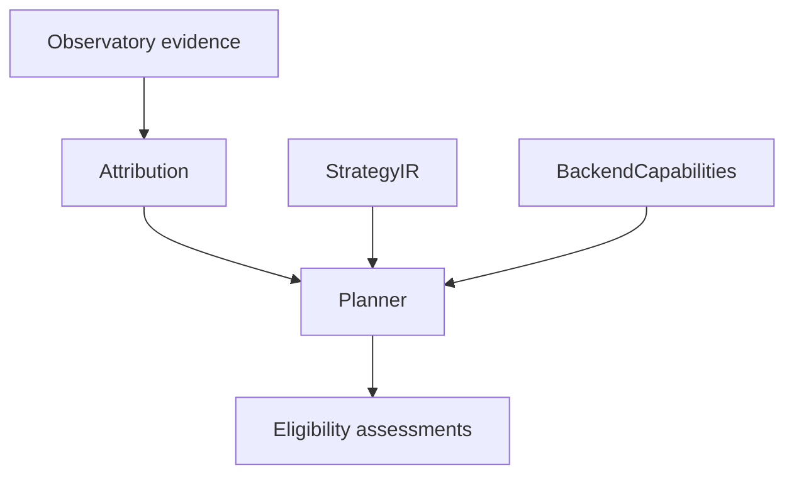

# Planner V1

## Boundary

Planner answers one pure question: given attribution evidence, a target, a set of StrategyIR documents, a caller-supplied scope snapshot, and a static backend, which strategies are structurally meaningful and executable to test?

It does not execute a backend, start or stop a provider, mutate networking, run Observatory or Strategy Lab, rank or score candidates, benchmark latency, select a winner, modify a profile, or invoke AutoTune. It reads no files, DNS, routes, interfaces, proxies, timestamps, privileges, or current engine state.

- **Attribution** describes what collected evidence suggests.
- **StrategyIR** describes a semantic packet strategy.
- **BackendCapabilities** describe what a pinned backend can preserve.
- **Planner** identifies strategies structurally worth testing.
- **AutoTune** is a future controlled experiment and execution layer.

## Deterministic contract

`planner.Plan(Request)` returns `PlannerReport` schema version `1` with the attribution ID, backend, target, disposition, non-preferential candidate assessments, and factual limitations. It adds no timestamp.

Candidate input order does not affect output. Valid duplicate canonical StrategyIR fingerprints are emitted once; invalid strategies remain individually visible. Candidate order is stable `strategy_id`, then fingerprint. This is serialization stability only, not preference.

V1 intentionally ships no CLI. A developer-only `--plan` file-input surface can be added later without changing this pure package; it is not needed to establish the planning boundary.

There are no score, rank, winner, best, probability, or expected-success fields. `ELIGIBLE` means all available structural gates passed:

- **not effective**;
- **not recommended**;
- **not a winner**;
- **not proof of censorship**.

`SafetyPolicy` is copied to every assessment. Aggressiveness is not a hidden preference, and experimental strategies remain visible.

## Evidence gates

| Attribution evidence | Planner disposition |
|---|---|
| `NO_ANOMALY`, `REACHABLE_DIRECTLY` | `NO_ACTION_NEEDED` |
| `HTTP_APPLICATION_FAILURE_OBSERVED` after a valid HTTP path | `NO_PACKET_STRATEGY_INDICATED` |
| `QUIC_UNSUPPORTED` | `INSUFFICIENT_EVIDENCE` |
| No concrete DNS/TCP/TLS/real-QUIC boundary | `INSUFFICIENT_EVIDENCE` |
| Concrete boundary with no eligible assessment | `NO_COMPATIBLE_CANDIDATES` |
| At least one eligible assessment | `CANDIDATES_AVAILABLE` |

Planner examines all findings, not only `PrimaryFinding`. A profile/A-B label such as `STILL_FAILING` or an edge-dependent primary finding does not invent a mechanism: a concrete underlying TLS/DNS/TCP boundary is used when present. Edge-dependent and successful-edge counterevidence remains a limitation and never increases confidence.

## Effect adapter and target selector

The conservative adapter maps StrategyIR into `attribution.StrategyCapabilities`; it contains no backend argv or flags.

- TCP strategies selecting TLS may affect `HELLO`/handshake only for `SPLIT`, `MULTI_SPLIT`, `MULTI_DISORDER`, `FAKE_INJECTION`, `HOST_FAKE_SPLIT`, and `TLS_RECORD_SPLIT`.
- `HTTP_HOST_CASE` affects HTTP only. Split forms affect HTTP only when the selector explicitly includes HTTP and the position is the `METHOD` anchor.
- QUIC `FAKE_INJECTION` is treated as QUIC initial/hello handling only when a real QUIC handshake boundary exists.
- DNS, TCP-connect, window-shaping, unknown, and ambiguous effects are never inferred from ClientHello operations.
- Raw UDP cannot become an evidence-driven candidate because Observatory V1 has no raw-UDP evidence model.

Planner delegates stage and transport comparison to `attribution.CouldStrategyAffectFailure`; it does not recreate contradictory stage logic. Before backend compilation, Planner also requires every applicable selector dimension to cover the concrete attributed target:

- The target port must parse as a nonzero `uint16`; TCP strategies use `TCPPorts`, QUIC strategies use `UDPPorts`, and a missing or malformed target port is `INSUFFICIENT_EVIDENCE`.
- Observatory V1 evidence is outbound client traffic. `OUTBOUND` and `BOTH` selectors are compatible; `INBOUND` is `STRUCTURALLY_INAPPLICABLE` with `TARGET_DIRECTION_MISMATCH`. Future inbound Observatory evidence can generalize this contract.
- `Request.Evidence.AddressFamily` is explicit evidence context, never parsed from `Attribution.NetworkContextKey`. `ANY` strategies accept IPv4 or IPv6; a specific family needs matching concrete evidence. Unknown family evidence is `INSUFFICIENT_EVIDENCE`; a known mismatch is `STRUCTURALLY_INAPPLICABLE`.

## Target scope snapshots

`ScopeSnapshot` is pure caller data: resolved logical host-list membership, resolved IP-set membership, and observed target-edge IPs. Planner never treats a logical ID such as `youtube` as evidence of membership.

`ALL` matches. Explicit and resolved host-list entries match normalized exact hosts and their subdomains (`example.com` matches `example.com` and `a.example.com`). Managed lists, auto-hostlists, exclusions, and IP sets are `TARGET_SCOPE_UNKNOWN` until the relevant membership is supplied. A known non-match or an exclusion is `TARGET_SCOPE_MISMATCH`. IP-set checks require target-edge IPs.

Positive IP-set IDs use Zapret's repeated `--ipset` union: one known membership match is sufficient; all known misses are a mismatch; an unknown set with no known match is unknown. A host/domain condition and additional positive IP-set IDs are both required. An `IP_SET_REFERENCE` host ID participates in the same positive union. Snapshot entries accept IPv4/IPv6 addresses and CIDRs through `net/netip`; malformed target or membership data is unknown, never a known miss.

Host-list and IP-set exclusions are vetoes. Any known exclusion match wins over missing or unknown exclusion snapshots; only when no exclusion matches does a missing or malformed required exclusion produce `TARGET_SCOPE_UNKNOWN`. Aggregation is independent of logical-ID input order.

## Backend and environment boundaries

Only structurally applicable, target-compatible strategies reach `backendcap.Compile`.

- `COMPILED` may become `ELIGIBLE` and copies `DerivedRequirements`.
- `UNSUPPORTED` becomes `BACKEND_UNSUPPORTED` with typed compiler reasons preserved.
- `INVALID` becomes `INVALID_STRATEGY`.

Static backend support is not host readiness. Planner performs no environment probing or preflight.
