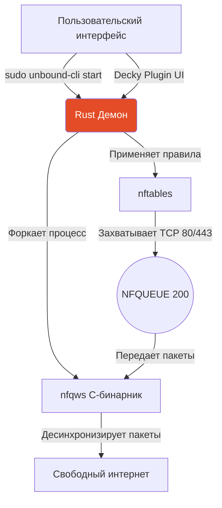

# 🐧 Unbound Linux — Демон обхода DPI и плагин Decky

Высокопроизводительный инструмент обхода систем фильтрации трафика (DPI) для Linux. Написан на надёжном **Rust**. Является интеллектуальной обёрткой над высокоэффективным бинарным файлом `nfqws` (изначально из проекта zapret) с автоматическим управлением маршуритизацией через **nftables**.

---

## 🔬 Архитектура и Принцип работы

Система работает на глубоком сетевом уровне, используя технологию `NFQUEUE` подсистемы ядра `netfilter`.



В отличие от VPN, маршрутизация происходит **локально**. Ваши IP пакеты фрагментируются и снабжаются ложными заголовками, разрушая любую вероятность их идентификации у провайдера.

---

## 🛠 Компоненты системы

| Файл | Назначение |
|------|----------|
| `src/main.rs` | CLI-Интерфейс: поддерживает `start`, `stop`, `status` |
| `src/nftables_mgr.rs` | Подсистема инъекции и безопасной очистки правил **nftables** |
| `src/nfqws.rs` | Оркестратор процессов: управляет PID, обрабатывает SIGTERM/SIGKILL |
| `src/daemon.rs` | Главный жизненный цикл приложения. Гарантирует очистку правил при краше демона. |

---

## 🚀 Установка и Запуск (Требуются права Root)

Демону требуются сырые сокеты (raw sockets) и модификация nftables, поэтому `sudo` обязателен.

```bash
# 1. Скачайте бинарный релиз
wget https://github.com/bobberdolle1/unbound/releases/latest/download/unbound-linux-amd64-v2.0.0

# 2. Выдайте права на исполнение
chmod +x unbound-linux-amd64-v2.0.0

# 3. Базовый запуск (автоподбор интерфейса)
sudo ./unbound-linux-amd64-v2.0.0 start
```

### Дополнительные команды CLI
```bash
# Точная настройка очереди и интерфейса
sudo unbound-cli start --iface eth0 --queue 200

# Ревизия статуса
sudo unbound-cli status

# Остановка (Гарантированная очистка nftables)
sudo unbound-cli stop
```

---

## 🛡 Безопасность nftables (Связанная архитектура)

Демон **создает временную таблицу `unbound`** в `inet` при старте:
```nftables
table inet unbound {
    chain post {
        type filter hook postrouting priority mangle;
        # Перехват первых 6 пакетов для экономии CPU (TFO)
        oifname "eth0" meta mark and 0x40000000 == 0 tcp dport {80,443} ct original packets 1-6 queue num 200 bypass
        oifname "eth0" meta mark and 0x40000000 == 0 udp dport {443} ct original packets 1-6 queue num 200 bypass
    }
}
```
> [!IMPORTANT]
> Правила **удаляются моментально** при любом прерывании (сбой процесса, SIGINT, `stop`). Вы никогда не потеряете доступ к интернету из-за зависших очередей NFQUEUE.

---

## 🏗 Сборка из исходников

```bash
git clone https://github.com/bobberdolle1/unbound.git
cd unbound/linux
cargo build --release
```
**Зависимости**: `cargo`, `rustc`, `libnetfilter_queue-dev`

## 🗃 Упаковка под дистрибутивы
Смотрите папку `../packaging/` для информации о сборке `.deb` (Ubuntu/Debian), `.rpm` (Fedora/RHEL) и PKGBUILD для Arch AUR.

---
**Лицензия**: GPL-3.0
