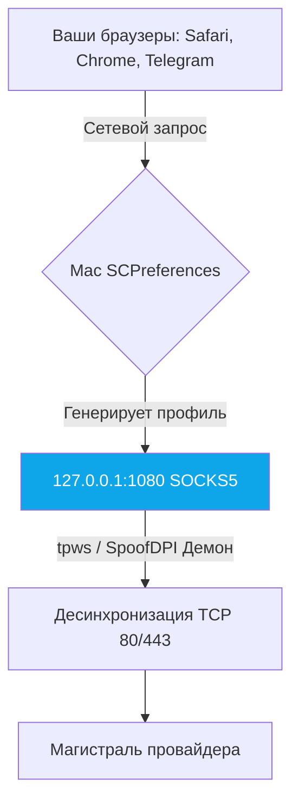

# 🍎 Unbound macOS — SOCKS5 Прокси и Ядерный PF

Нативный модуль для Apple macOS (Intel x86_64 и Apple Silicon M1-M3). В отличие от Windows, macOS не позволяет драйверам уровня `WinDivert` вмешиваться в стек на лету без отключения SIP (System Integrity Protection). 

Поэтому мы используем элегантное решение: локальный прозрачный SOCKS5 прокси (`SpoofDPI` / `tpws`) с глобальной системной регистрацией.

---

## 🔬 Интеграция в систему

Мы используем мощные Unix/Darwin инструменты для бесшовного опыта:



### 1. Ядро (kqueue)
Программа использует системный вызов `kqueue` вместо `epoll` для высокопроизводительного мультиплексирования. Скрипты полностью адаптированы под Mach-O файловую систему.

### 2. Системные настройки (SCPreferences API)
Как только вы нажимаете кнопку «Подключить» в приложении, наш движок вызывает проприетарное `SCPreferences` API.
Оно автоматически идет в "Настройки -> Сеть -> Прокси" и включает системный SOCKS5 на порту `1080`. 
Как только вы выключаете программу, API мгновенно откатывает настройки, не оставляя систему без интернета.

---

## 🚀 Установка (Без терминала)

Для 99% пользователей:
1. Скачайте `Unbound-macOS-Universal.app.zip` со страницы релизов.
2. Распакуйте и перенесите в папку `Программы` (Applications).
3. Запустите. При первом запуске может потребоваться зайти в "Системные настройки -> Конфиденциальность -> Разрешить запуск", так как это независимый Open Source проект без жесткой цифровой подписи Apple.
4. Нажмите «Подключить» в приложении.

---

## 🔥 Сборка (Для контрибьюторов)

Для компиляции обертки и GUI под macOS используется фреймворк Wails (в корне репозитория):

```bash
# 1. Установите инструменты Xcode
xcode-select --install

# 2. Установите Go и Node.js (рекомендуется brew)
brew install go node

# 3. Установите Wails CLI
go install github.com/wailsapp/wails/v2/cmd/wails@latest

# 4. Сборка из корня проекта для вашего процессора (Apple Silicon)
wails build -platform darwin/arm64

# Или если вы на Intel Mac (x86_64):
wails build -platform darwin/amd64
```

Собранный `.app` паккет появится в папке `build/bin/`. 

---

## 🛠 Устранение неполадок (Troubleshooting)

**Интернет пропал после некорректного закрытия программы:**
Если приложение "упало" (crash) и не успело удалить за собой настройки прокси, то Mac будет пытаться отправлять трафик на выключенный порт 1080.
**Решение:** Откройте `Системные настройки` -> `Сеть` -> `Ваш Wi-Fi` -> `Подробнее` -> `Прокси`. И уберите галочку с `SOCKS-прокси`.

Или сделайте это через терминал:
```bash
networksetup -setsocksfirewallproxystate Wi-Fi off
```

**Лицензия**: GPL-3.0
