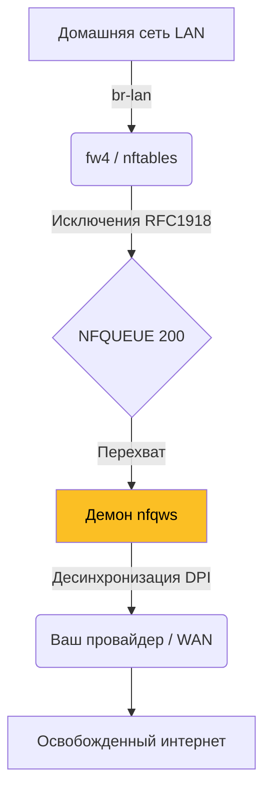

# 🌐 Unbound OpenWrt — Демон обхода для Маршрутизаторов

Абсолютно прозрачный обход DPI и цензуры прямо на сетевом роутере. Обеспечивает свободным интернетом все устройства в вашей домашней сети (WiFi/LAN) без необходимости устанавливать клиенты локально.

---

## 🔬 Принцип работы

Пакеты из вашей сети (от смарт-телевизоров до телефонов) перехватываются сетевым файрволом роутера `fw4 (nftables)` до их выхода в интернет. 



---

## 🚀 Установка (Для пользователей)

Для вашего удобства скомпилирован пакет, который автоматически внедряется в веб-интерфейс (LuCI).

1. Скачайте `.ipk` плагины `unbound-wrt` и `luci-app-unbound` из релизов.
2. Подключитесь к роутеру:
   ```bash
   scp *.ipk root@192.168.1.1:/tmp/
   ```
3. Установите через opkg:
   ```bash
   ssh root@192.168.1.1
   opkg install /tmp/nfqws-unbound_*.ipk
   opkg install /tmp/luci-app-unbound_*.ipk
   ```
4. Включите автозапуск:
   ```bash
   /etc/init.d/unbound enable && /etc/init.d/unbound start
   ```

Теперь в веб-интерфейсе OpenWrt (LuCI) в меню **Сервисы** появится вкладка **Unbound-WRT**, где можно графически настраивать стратегии и исключения!

---

## 🛠 Сборка из исходников (OpenWrt SDK)

Если архитектура вашего роутера отличается (напр., экзотический `mipsel_24kc` или старый `ar71xx`), вам придется собрать пакет самостоятельно.

### 1. Подготовка SDK
Найдите и скачайте Linux SDK именно для вашей версии OpenWrt (21.0, 22.03, 23.05).
```bash
wget https://downloads.openwrt.org/releases/23.05.0/targets/ath79/generic/openwrt-sdk-23.05.0-ath79-generic_gcc-12.3.0_musl.Linux-x86_64.tar.xz
tar xf openwrt-sdk-*.tar.xz
cd openwrt-sdk-*
```

### 2. Подключение модулей
```bash
cp -r /path/to/unbound/openwrt/unbound-wrt package/
cp -r /path/to/unbound/openwrt/luci-app-unbound package/
./scripts/feeds update -a && ./scripts/feeds install -a
```

### 3. Компиляция
```bash
make menuconfig
# Network > Web Servers/Proxies > nfqws-unbound (Установить как M)
# LuCI > 3. Applications > luci-app-unbound (Установить как M)

# Сборка пакетов
make package/nfqws-unbound/compile V=s
make package/luci-app-unbound/compile V=s
```

Ваши `.ipk` файлы будут ждать вас в подпапке `bin/packages/`.

---
**Лицензия**: GPL-3.0
