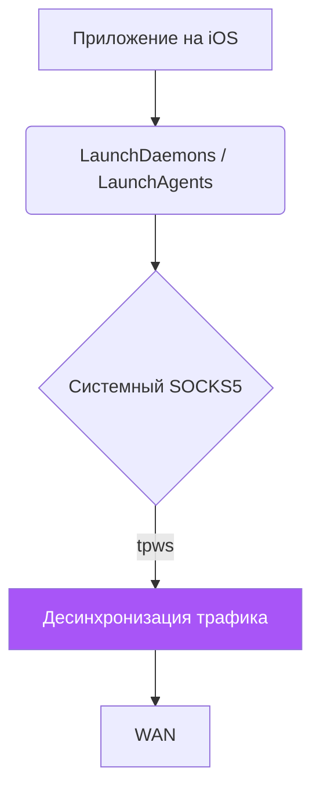

# 🍏 Unbound iOS — Нативный Theos Демон (Jailbreak)

Данная директория содержит исходный код для сборки `Unbound Legacy` — специализированного демона, обходящего DPI-блокировки прямо на вашем iPhone/iPad. Это работает исключительно на взломанных (Jailbreak) устройствах.

---

## 🔬 Системный уровень

Ядро Apple iOS имеет жестко ограниченный сетевой стек. Поскольку создание полноценных VpnService без доступа от Apple Enterprise невозможно, мы идем ниже — прямо в Darwin-пространство пользователя с высшими правами.



Мы используем `tpws` как локальный анти-DPI шлюз, а настройки прокси применяются глобально через системные конфигурации iOS.

---

## 🛠 Подготовка среды сборки (Theos Build)

Если вы хотите собрать `.deb/ipa` файл под любую версию iOS, вам понадобится `Theos`.

### 1. Установка Theos (macOS / Linux / iOS-Терминал)
Установка на macOS (с установкой Command Line Tools):
```bash
sudo mkdir -p /opt/theos
sudo chown $(id -u):$(id -g) /opt/theos
git clone --recursive https://github.com/theos/theos.git /opt/theos
echo "export THEOS=/opt/theos" >> ~/.zshrc
source ~/.zshrc
```

### 2. Загрузка iOS SDK
Скачайте пропатченные SDK (вплоть до SDK 16+):
```bash
curl -LO https://github.com/theos/sdks/archive/master.zip
unzip master.zip
mv sdks-master/* $THEOS/sdks/
```

### 3. Сборка твика
Перейдите в директорию `theos/unbound-legacy` и укажите IP вашего телефона:

```bash
export THEOS_DEVICE_IP=192.168.1.10
export THEOS_DEVICE_PORT=22

# Для Rootful джейлбрейков (unc0ver, palera1n, checkra1n)
make package install

# Для Rootless джейлбрейков (Dopamine, palera1n rootless)
make package ROOTLESS=1 install
```

Приложение и локальный демон автоматически загрузятся на устройство через SSH и будут внедрены в `/Library/MobileSubstrate/DynamicLibraries/` (или `/var/jb/...`).

---

## 🧰 Архитектура Твика `Makefile`

В проекте 3 основных стадии:
1. `Tweak.x` (LogoHook/CydiaSubstrate) — Внедрение в системный контроллер для принудительного направления трафика нужных приложений в `127.0.0.1`.
2. Бинарный `tpws` (откомпилированный под ARM64 / Mach-O), который автоматически стартует через `launchctl`.
3. Управляющий интерфейс `Preferences/PreferenceLoader` для включения модуля прямо из Настроек iOS.

> [!WARNING]
> Поддержка Rootless джейлбрейков пока что экспериментальна. Учитывайте пути, используемые при сборке (`/var/jb/`).

**Лицензия**: GPL-3.0
